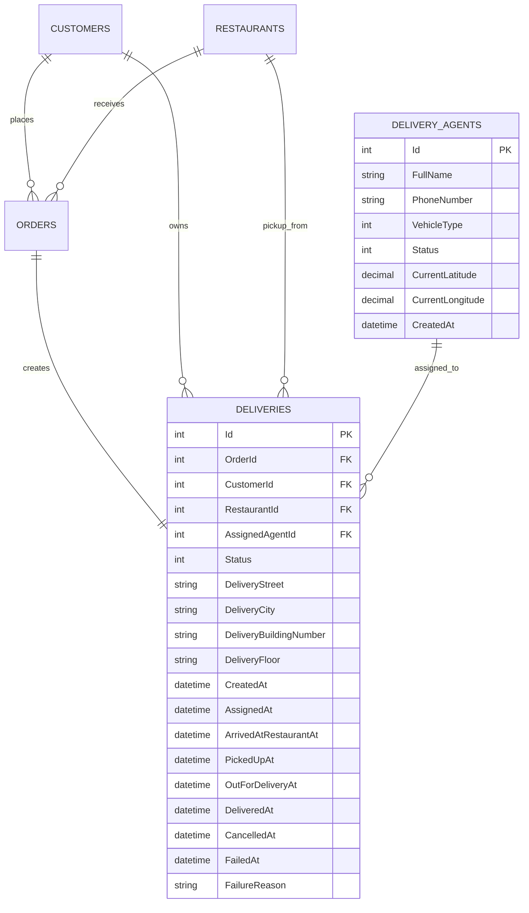

# Delivery Database Design

This document describes future persistence protection for the Delivery Extension. It does not create EF Core mappings or migrations.

## DeliveryAgents Table

| Column | Database type | Nullability | Purpose |
|---|---|---|---|
| Id | int | Required, PK | DeliveryAgent identity. |
| FullName | nvarchar(150) | Required | Courier name. |
| PhoneNumber | nvarchar(30) | Nullable | Optional contact number. |
| VehicleType | int | Required | VehicleType enum value. |
| Status | int | Required | DeliveryAgentStatus enum value. |
| CurrentLatitude | decimal(9,6) | Nullable | Optional current latitude. |
| CurrentLongitude | decimal(9,6) | Nullable | Optional current longitude. |
| CreatedAt | datetime2 | Required | Profile creation time. |

CurrentLatitude and CurrentLongitude should both be null or both be populated. When populated, latitude must be between -90 and 90 and longitude must be between -180 and 180.

## Deliveries Table

| Column | Database type | Nullability | Purpose |
|---|---|---|---|
| Id | int | Required, PK | Delivery identity. |
| OrderId | int | Required, unique FK | One-to-one Order reference. |
| CustomerId | int | Required, FK | Delivery customer reference. |
| RestaurantId | int | Required, FK | Pickup restaurant reference. |
| AssignedAgentId | int | Nullable, FK | Assigned courier reference. |
| Status | int | Required | DeliveryStatus enum value. |
| DeliveryStreet | nvarchar(200) | Required | Address snapshot street. |
| DeliveryCity | nvarchar(100) | Required | Address snapshot city. |
| DeliveryBuildingNumber | nvarchar(50) | Required | Address snapshot building. |
| DeliveryFloor | nvarchar(50) | Nullable | Address snapshot floor. |
| CreatedAt | datetime2 | Required | Delivery creation time. |
| AssignedAt | datetime2 | Nullable | Assignment time. |
| ArrivedAtRestaurantAt | datetime2 | Nullable | Restaurant arrival time. |
| PickedUpAt | datetime2 | Nullable | Pickup time. |
| OutForDeliveryAt | datetime2 | Nullable | Out-for-delivery time. |
| DeliveredAt | datetime2 | Nullable | Completion time. |
| CancelledAt | datetime2 | Nullable | Cancellation time. |
| FailedAt | datetime2 | Nullable | Failure time. |
| FailureReason | nvarchar(300) | Nullable | Required by Domain when status is Failed. |

## Relationships

- Orders have a one-to-one relationship with Deliveries through unique `Deliveries.OrderId`.
- Customers have a one-to-many relationship with Deliveries.
- Restaurants have a one-to-many relationship with Deliveries.
- DeliveryAgents have a one-to-many historical relationship with Deliveries through nullable `AssignedAgentId`.
- Delivery may have no assigned agent while `PendingAssignment`.

These foreign keys protect reference integrity in persistence. The Domain model stores IDs and does not require navigation object references.

## Constraints And Indexes

- `Deliveries.OrderId` must be unique.
- `Deliveries.AssignedAgentId` is nullable.
- Required identity foreign keys must not be null.
- Status and vehicle enum values should be constrained to known values where practical.
- CurrentLatitude and CurrentLongitude should satisfy paired-null and coordinate-range checks.
- One active delivery per agent should be protected with a filtered unique index.

Active assigned statuses are:

- `Assigned` = 2
- `ArrivedAtRestaurant` = 3
- `PickedUp` = 4
- `OutForDelivery` = 5

Conceptual SQL Server filtered unique index:

```sql
CREATE UNIQUE INDEX UX_Deliveries_AssignedAgent_Active
ON Deliveries(AssignedAgentId)
WHERE AssignedAgentId IS NOT NULL
  AND Status IN (2, 3, 4, 5);
```

Provider support and exact filtered-index syntax must be verified when Infrastructure is implemented.

Do not add `CurrentDeliveryId` to DeliveryAgents. Doing so would duplicate assignment state, create a circular relationship, and make Delivery and DeliveryAgent disagree under partial updates.

## ERD


