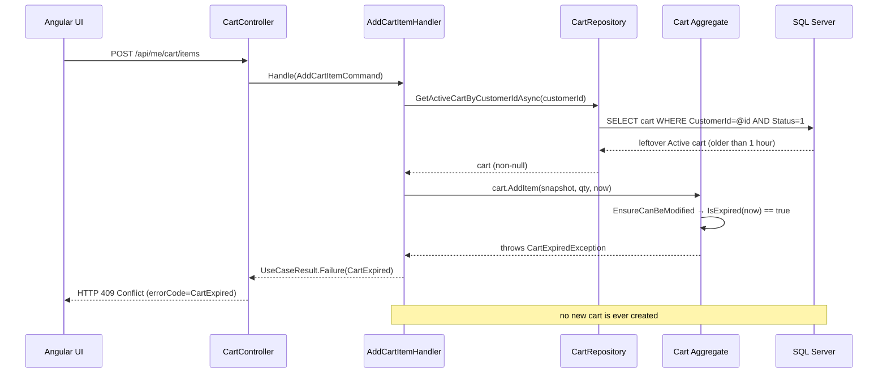
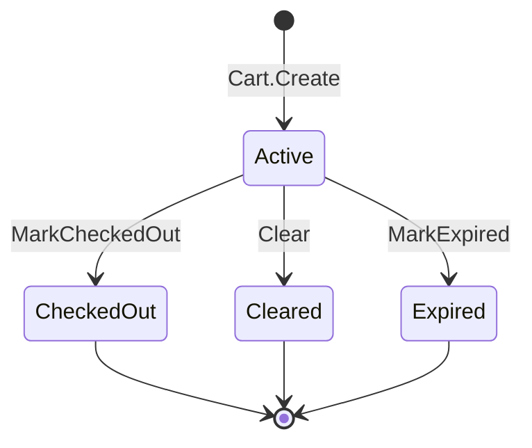

# Expired Cart Lifecycle Fix — Deep Learning Guide

A study chapter for a .NET / DDD / EF Core backend student.

This guide explains, from first principles, a real bug that was found and fixed in the Talabat backend repository. The bug is **already fixed and manually verified**. This document teaches you what the bug was, why it happened, why only some accounts were affected, how the fix works, why every changed file and every changed line was needed, and what lessons you should keep for your next backend feature.

> **Accuracy note up front.** The task prompt you were given described the root cause as "the repository returned a cart for the customer without requiring `Status == Active`". I verified this claim against the real repository and it is **not** what happened in this codebase. The repository always filtered by `Status == Active` (both before and after the fix). The real root cause is the missing **expiry-recovery branch** in the handler plus the **read path treating an expired cart as an error**. The guide below reflects the *actual* code and diff. Anything that is inference rather than verified repository fact is explicitly marked.

---

## 1. The bug in simple language

### What the user experienced

Two groups of customers, two different experiences:

- **Newly created customer accounts** could add products to their cart normally.
- **Older customer accounts** often could not add products. The app showed the cart as *expired*. Every attempt to add a product returned `HTTP 409 Conflict`. Signing out and signing back in did not help. Many old accounts had the same problem.

### The beginner version

```
New customer:
  No old cart → server creates a fresh Active cart → adding a product succeeds.

Old customer:
  A historical/leftover cart exists → the server picks it up → the cart refuses to
  change because it is "finished" (or too old) → adding a product fails with 409 → 
  nothing ever creates a fresh cart → the customer is stuck forever.
```

The critical last part: **nothing ever created a fresh cart.** The system refused the change, but it did not offer a way out.

### The technical version

A cart in this system has a lifecycle (see section 2). Only an **Active** cart can be modified, and only while it is young enough (1 hour). Once a cart is checked out, cleared, or expires, it becomes **historical**: it must never be changed again.

The bug lived in the orchestration (Application layer): when a customer already had an Active cart that was **older than the 1-hour expiry window**, the handler tried to mutate that cart, the cart's internal rule correctly threw `CartExpiredException`, that exception was translated into `409 Conflict`, and **no code path created a replacement Active cart**. Old accounts were affected because they had leftover Active carts from long ago. New accounts were not affected because they had no cart at all (so the handler took the "no cart → create one" path) or a fresh cart that was still inside its 1-hour window.

---

## 2. What a Cart represents in this project

Before explaining the bug you need the domain model. Every concept below exists in real Talabat code.

### The DDD vocabulary, mapped to this project

**Aggregate**: a cluster of objects treated as one unit for changes. In Talabat, `Cart` is an aggregate.

**Aggregate Root**: the entity at the top of the aggregate that is the only entry point. All reads and writes go through the `Cart` object, never through its items directly. In code: `Cart` (a `sealed class : AuditableEntity`) owns its items in a private `List<CartItem> _items`. The items are never exposed for mutation: the public API is `IReadOnlyCollection<CartItem> Items => _items.AsReadOnly();`.

**Entity**: an object with an identity. `Cart` has `Id`, `CustomerId`, `RestaurantId`. `CartItem` has a composite identity `(CartId, ProductId)` — see the EF configuration `item.HasKey("CartId", nameof(CartItem.ProductId))`.

**Value Object**: an immutable object compared by value. `Money`, `CatalogProductSnapshot`, `TimeRange`, `Address` are value objects. The cart stores a **snapshot** (`CatalogProductSnapshot`) of what was added, not the live product, which is why the read handler re-prices items from current catalog prices.

**Invariant**: a rule that must always be true for the aggregate, enforced at every change. `Cart` has several:

- Only `CartStatus.Active` carts can be modified (`EnsureCanBeModified`).
- A cart can only be modified inside its expiry window (`IsExpired`).
- All items in a cart must belong to the same restaurant (`CrossRestaurantCartException`).
- Quantities must be positive (`InvalidQuantityException`).
- A cart that is checked out must not be empty (`EmptyCartCheckoutException`).

**Domain rule**: a business rule expressed in code, in the Domain layer, independent of databases or HTTP. `EnsureCanBeModified`, `MarkExpired`, `GetTotal` are domain rules.

**Domain exception**: an exception thrown by the aggregate to express a *business* violation rather than a programming error. Talabat has `CartExpiredException`, `CartNotActiveException`, `CrossRestaurantCartException`, `ConcurrencyConflictException`, `EmptyCartCheckoutException`, etc., all deriving from abstract `DomainException`.

**Lifecycle**: the sequence of states an aggregate goes through. For a cart: `Active → CheckedOut | Cleared | Expired`. Once a cart leaves `Active`, it never comes back. (Section 9 covers the state machine.)

**Repository**: an abstraction over persistence. The Domain defines the interface `ICartRepository` (methods `GetActiveCartByCustomerIdAsync`, `AddAsync`, `Update`); the Infrastructure layer implements it with EF Core in `CartRepository`.

**Unit of Work**: a coordinator that makes all pending changes durable in one `SaveChanges`. In Talabat, `IUnitOfWork.SaveChangesAsync` wraps `DbContext.SaveChangesAsync` and converts database uniqueness violations into `ConcurrencyConflictException`.

**Persistence**: storing entities between requests. EF Core + SQL Server here.

**Application layer**: orchestration. Decides *what workflow* to run (e.g., "there is no usable cart, so create one and add the item"). It does not decide what a valid cart *is* — that is the Domain's job.

**Infrastructure layer**: plumbing — EF configurations, repositories, migrations, the clock.

**API layer**: HTTP. Translates success/failure into `200/400/404/409/422...`.

### The Cart aggregate in detail

`Cart` lives in `src/Talabat/Talabat.Domain/Aggregates/Basket/Cart.cs`.

Its relevant members:

```csharp
public sealed class Cart : AuditableEntity
{
    private static readonly TimeSpan ExpirationPeriod = TimeSpan.FromHours(1);
    private readonly List<CartItem> _items = [];

    public int Id { get; private set; }
    public int CustomerId { get; }
    public int RestaurantId { get; private set; }
    public CartStatus Status { get; private set; }
    public IReadOnlyCollection<CartItem> Items => _items.AsReadOnly();

    private Cart(int customerId, DateTime createdAt) { ... }   // private ctor
    public static Cart Create(int customerId, CatalogProductSnapshot firstProduct,
                              int quantity, DateTime createdAt) { ... }
    public bool IsExpired(DateTime currentTime) => currentTime >= CreatedAt.Add(ExpirationPeriod);
    public void AddItem(...)  { EnsureCanBeModified; availability check; cross-restaurant check; ... }
    public void UpdateQuantity(int productId, int quantity, DateTime currentTime) { ... }
    public void RemoveItem(int productId, DateTime currentTime) { ... }
    public void Clear(DateTime currentTime) { ...; Status = CartStatus.Cleared; }
    public void MarkCheckedOut(DateTime currentTime) { ...; Status = CartStatus.CheckedOut; }
    public void MarkExpired(DateTime currentTime) { ...; Status = CartStatus.Expired; }
    private void EnsureCanBeModified(DateTime currentTime) { ... }
}
```

Key points to internalize:

- **Customer ownership**: a cart belongs to exactly one customer (`CustomerId`), and `CustomerId` is set in the constructor — it cannot change later (read-only property).
- **Restaurant invariant**: a cart is for one restaurant. The first item decides `RestaurantId`; adding an item from another restaurant throws `CrossRestaurantCartException`.
- **Mutable vs non-mutable cart**: only `Status == Active` allows changes. This is the *invariant* the whole bug revolves around.
- **Expiry**: expiry is **computed**, not stored. `IsExpired(now)` compares `now` against `CreatedAt + 1 hour`. The DB does not store an "expired at" timestamp; the code derives it.
- **Historical carts**: `CheckedOut`, `Cleared`, and now `Expired` carts are historical/final. They are kept in the database for audit, analytics, and re-purchase, but are never modified again.

### CartItem

`CartItem` (`src/Talabat/Talabat.Domain/Aggregates/Basket/CartItem.cs`) holds `ProductId`, `ProductName`, `Quantity`. It guards its own quantity invariant (positive) and only exposes mutation through internal methods called by the aggregate: `IncreaseQuantity`, `SetQuantity`. `GetLineTotal(currentUnitPrice)` = `currentUnitPrice.Multiply(Quantity)`.

### CartStatus

`CartStatus` is a plain enum in `src/Talabat/Talabat.Domain/Aggregates/Basket/CartStatus.cs`:

```csharp
public enum CartStatus
{
    Active = 1,
    CheckedOut = 2,
    Cleared = 3,
    Expired = 4   // added by this fix
}
```

---

## 3. Where the bug lived architecturally

This bug was primarily an **Application-layer orchestration bug**, with a supporting **read-path (Application) bug**, plus a **database-schema constraint** that had to be updated to make the fix complete.

| Layer | Role in this bug |
|---|---|
| Domain | Correct. The aggregate already detected expiry and refused mutation. It was *not* changed to fix the bug's core, only extended with a `MarkExpired` transition (which the Application layer now uses). |
| Application | **Primary bug.** `AddCartItemHandler` had no recovery branch for "active but expired". `GetCartHandler` also turned an expired cart into an error response instead of "no cart". |
| Infrastructure | Supporting. The repository was already correct (`Status == Active`). The `UnitOfWork` gained unique-constraint → `ConcurrencyConflictException` translation so the concurrency race that the new lifecycle creates is handled cleanly. |
| Database | Supporting. The `CK_Carts_Status` check constraint had to accept the new `Expired = 4` value. |
| API | Innocent bystander. It faithfully translated a domain error into `409 Conflict`. |
| Frontend (Angular) | Innocent bystander. It showed the error that the backend returned. |

### Why the visible Angular error did not mean Angular caused the bug

The frontend can only display what the API returns. The Angular app did not compute cart status; it just called `POST /api/me/cart/items` and rendered the response. The `409` came from the backend (the `ProblemDetails` body with `errorCode: "CartExpired"`). The UI is a *symptom reporter*, not the *cause*. In any bug hunt, seeing the symptom in the browser tells you where to look *last*, not first (see section 25).

---

## 4. Full request flow before the fix

Real classes and methods, in execution order:

1. Angular calls `POST /api/me/cart/items` with `{ restaurantId, productId, quantity }`.
2. `CartController.AddItem` (`src/Talabat/Talabat.API/Controllers/CartController.cs`) is matched by `[Route("api/me/cart")]` + `[HttpPost("items")]`. It has `[Authorize(Policy = AuthorizationPolicies.CustomerAccess)]` and `[RequireCustomerProfile]`.
3. The controller reads the customer id from the token (`_currentUser.CustomerId!.Value`) and builds `AddCartItemCommand(CustomerId, RestaurantId, ProductId, Quantity)`.
4. `AddCartItemHandler.Handle` runs:
   - `_restaurantRepository.GetProductSnapshotAsync(restaurantId, productId)` → `CatalogProductSnapshot` (or `null` → `ResolveMissingProduct`).
   - `_cartRepository.GetActiveCartByCustomerIdAsync(customerId)` → `Cart?`.
   - If `cart is null` → `Cart.Create(...)` + `AddAsync`.
   - **Else** → `cart.AddItem(snapshot, quantity, now)` (this is where it broke).
5. `CartRepository.GetActiveCartByCustomerIdAsync` runs the EF query:
   ```csharp
   _dbContext.Carts
       .Include("_items")
       .SingleOrDefaultAsync(cart => cart.CustomerId == customerId && cart.Status == CartStatus.Active, ct);
   ```
6. `Cart.AddItem` calls `EnsureCanBeModified(now)`:
   ```csharp
   private void EnsureCanBeModified(DateTime currentTime)
   {
       if (Status != CartStatus.Active) throw new CartNotActiveException();
       if (IsExpired(currentTime)) throw new CartExpiredException();
   }
   ```
   For an old account with a leftover Active cart older than one hour: `IsExpired(now)` is `true` → `CartExpiredException`.
7. `AddCartItemHandler` catches it (`catch (Exception exception) when (exception is DomainException or ArgumentException)`) and returns `UseCaseResult.Failure(DomainExceptionMapper.Map(exception))`.
8. `DomainExceptionMapper` maps `CartExpiredException` → `ApplicationError(ApplicationErrorCodes.CartExpired, ApplicationErrorCategory.Conflict, "This cart has expired. Please start a new cart.")`.
9. `UseCaseResultExtensions.ToActionResult` maps `Conflict` → `Status409Conflict` + `ProblemDetails` with `errorCode: "CartExpired"`.
10. HTTP `409 Conflict` reaches the Angular UI. **No new cart was created.**

### Wrong-decision inventory

| Step | What happened | Wrong decision? |
|---|---|---|
| 2 | Controller built command | No |
| 4a | Product snapshot fetched | No |
| 4b | Active cart retrieved | No — this already filtered `Active` |
| 4c | `cart.AddItem` called on an expired Active cart | **Yes — no `IsExpired` check before mutating; no recovery** |
| 6 | Aggregate threw `CartExpiredException` | Correct behaviour — the aggregate protected its invariant |
| 7-9 | Exception became `409` | Correct translation, but the outcome was the bug the user saw |

### Mermaid sequence diagram (before the fix)



---

## 5. Why sign-out/sign-in could never fix it

This is the most important "why" to internalize.

### Two completely different kinds of state

**Authentication / session state** is about *who you are right now, in this browser*. It lives in memory/tokens/cookies: the access token, the refresh token, the IdentityServer cookie. Logging out destroys the token; logging in creates a new one. **It has nothing to do with the cart.**

**Persisted domain state** is about *facts stored in the database*: cart rows, their status, their items. These survive logout, survive browser restarts, survive server restarts. They are only changed by business operations, not by authentication.

| State | Example | Lives where? |
|---|---|---|
| Login state | access token / refresh token / cookie | auth provider (IdentityServer), browser storage, memory |
| User identity | `CustomerId` derived from the token's `sub` claim | backend token validation |
| Cart status | `Active` / `CheckedOut` / `Cleared` / `Expired` | SQL database (`Carts.Status`) |
| Cart items | product + quantity | SQL database (`CartItems`) |

### Why logout cannot repair the cart

When you log out, the server does not run `DELETE FROM Carts WHERE CustomerId = ...`. It only invalidates tokens. The leftover Active cart row (with `Status = 1`, `CreatedAt` weeks old) is still there. The next login produces a fresh token with the **same `CustomerId`** — and `GetActiveCartByCustomerIdAsync` finds the same old cart again. The old cart is still expired, `AddItem` still throws, the UI still shows the expired cart.

The bug was in **durable state**, so the fix had to change **how durable state is read and written** — not authentication.

---

## 6. Exact root cause

### Primary root cause (Application layer)

`AddCartItemHandler` assumed that "an Active cart exists" is always enough to mutate it. It checked `cart is null` but **never checked whether the Active cart was still within its expiry window**. When the Active cart was older than one hour, `Cart.AddItem` correctly threw `CartExpiredException`, which became `409`, and the handler had **no branch that retired the expired cart and created a fresh one**. The customer could never progress.

Pre-fix handler logic (simplified, actual code):

```csharp
if (cart is null)
{
    cart = Cart.Create(command.CustomerId, snapshot, command.Quantity, now);
    await _cartRepository.AddAsync(cart, cancellationToken);
}
else
{
    cart.AddItem(snapshot, command.Quantity, now);   // <- throws for an expired Active cart
    _cartRepository.Update(cart);
}
```

There was **no** `else if (cart.IsExpired(now))` branch, so no recovery.

### Contributing design problem (read path)

`GetCartHandler` treated an expired Active cart as an **error**: it returned `UseCaseResult.Failure(DomainExceptionMapper.Map(new CartExpiredException()))` → `409`. The correct read-model behaviour is "expired means there is no usable cart" → return an empty cart. The UI then shows the expired cart *as the cart* — which matches the reported symptom "the UI showed that the cart was expired".

### Persistence/schema problem

The `Expired` value did not exist in the domain enum, and the database check constraint `CK_Carts_Status` only allowed `(1, 2, 3)`. Once the fix introduced `Status = Expired (4)`, both the C# enum **and** the SQL constraint had to accept `4`, otherwise the very recovery the fix provides would fail at `SaveChanges` with a CHECK constraint violation.

### Missing test coverage

No test covered the scenario **"a returning customer whose existing Active cart is past its expiry window"**. Existing tests covered "no cart" and "fresh cart", which is exactly why the bug felt invisible: every developer test passed. The fix added tests at Domain, Application, Persistence, and API layers for exactly the missing scenario (section 19).

### What the aggregate did correctly

It is worth repeating: `Cart.EnsureCanBeModified` refusing to mutate an expired cart was **correct domain behaviour**. The bug was that the orchestration layer did not handle that refusal gracefully. Domain invariants are not the enemy; they are the tripwire that this bug was missing around.

---

## 7. Before vs after repository behaviour

**Important fact:** `CartRepository` and `ICartRepository` were **not changed** by this fix. The method has always been `GetActiveCartByCustomerIdAsync`, and its query has always included `cart.Status == CartStatus.Active`.

```csharp
// unchanged, before and after the fix
public Task<Cart?> GetActiveCartByCustomerIdAsync(
    int customerId, CancellationToken cancellationToken = default)
{
    return _dbContext.Carts
        .Include("_items")
        .SingleOrDefaultAsync(
            cart => cart.CustomerId == customerId && cart.Status == CartStatus.Active,
            cancellationToken);
}
```

### Why `CustomerId` alone is insufficient

A customer accumulates many cart rows over time (see section 22: a customer can have `Cleared`, `CheckedOut`, `Expired`, and `Active` carts). Querying `WHERE CustomerId = @id` would return several rows. Which one is the *current shopping session*? Only `Status == Active` answers that. That is why the filter exists and why the repository name says "Active" out loud.

### Why `Status == Active` matters

It encodes the lifecycle into the query. "Current cart" is a derived concept: *the one cart with `Status = 1`*.

### What `null` means now

`null` from `GetActiveCartByCustomerIdAsync` means exactly one thing: **"this customer has no current shopping session."** That is a *normal, expected* state — a brand-new customer, a customer who cleared their cart, a customer who checked out, a customer whose cart expired.

### Why `null` is not an error

This is a mental-model shift. `null` from a repository is not necessarily `404`. It depends on the *meaning* of the query. "Give me the current cart" returning nothing is a valid business fact; the handler must decide what to do about it (here: create a new cart). The pre-fix handler already handled `null` correctly — its mistake was only about the *non-null but expired* case.

---

## 8. Corrected lifecycle

### The new algorithm, derived from the actual implementation

`AddCartItemHandler.Handle` (post-fix) does this:

```
snapshot = restaurantRepository.GetProductSnapshotAsync(restaurantId, productId)
if snapshot is null → ResolveMissingProduct (404 ProductNotFound / RestaurantNotFound)

now = clock.UtcNow
cart = cartRepository.GetActiveCartByCustomerIdAsync(customerId)

if cart is null:
    cart = Cart.Create(customerId, snapshot, quantity, now)   // new Active cart
    cartRepository.AddAsync(cart)

else if cart.IsExpired(now):
    cart.MarkExpired(now)            // Active → Expired (domain transition)
    cartRepository.Update(cart)      // persist the retired cart
    cart = Cart.Create(customerId, snapshot, quantity, now)   // fresh Active cart
    cartRepository.AddAsync(cart)

else:
    cart.AddItem(snapshot, quantity, now)   // mutate the fresh/young Active cart
    cartRepository.Update(cart)

restaurant = restaurantRepository.GetByIdWithProductsAsync(cart.RestaurantId)
if restaurant is null → 404 RestaurantNotFound

unitOfWork.SaveChangesAsync()        // everything saved in one transaction
details = CartMapper.ToDetails(cart, restaurant)
return Success(details)
```

### Explaining each branch

- **No Active cart (`null`)** → create a new Active cart containing the requested item. Covers brand-new customers, and customers who checked out, cleared, or had their cart expire with `Status` persisted.
- **Active but expired** → *retire first, then create*. The old cart is transitioned to `Expired` and saved, then a brand-new Active cart is created for the requested item. This preserves history (old cart kept) while unblocking the customer.
- **Active and fresh** → the normal path: add/increase the item on the existing cart.

The critical ordering in the expired branch: **`MarkExpired` + `Update` before creating the new cart.** Why? Because the database enforces *one Active non-deleted cart per customer* (unique filtered index, section 15/17). If you created the new Active cart while the old one was still `Active`, the unique index would reject the insert. Retiring the old cart first frees the slot.

---

## 9. Cart state machine

Real states (`CartStatus`) and real transitions (from `Cart` aggregate methods):



### Which states allow mutation?

Only `Active`, and only while inside the expiry window. `EnsureCanBeModified`:

```csharp
if (Status != CartStatus.Active) throw new CartNotActiveException();
if (IsExpired(currentTime)) throw new CartExpiredException();
```

### Which states are historical/final?

`CheckedOut`, `Cleared`, `Expired`. None of them can transition back to `Active`. There is no "revive" path — by design. A finished cart is an auditable fact.

### Why creating a new cart is different from reviving a historical cart

Reviving a historical cart would mean re-opening something that was recorded as final (e.g., a checked-out cart that became an order, or a cleared cart). That breaks the audit trail: you could silently change what was actually sold/abandoned. Creating a **new** cart keeps the historical rows immutable and gives the customer a fresh session with a new identity (`Id`), a new `CreatedAt`, and a fresh 1-hour window.

---

## 10. File-by-file deep explanation

The changed-file list, discovered via `git status` / `git diff` (branch `feature/user-aggregate-refactor`):

**Tracked modifications (11 files, +259 / −10):**

1. `src/Talabat/Talabat.Domain/Aggregates/Basket/CartStatus.cs`
2. `src/Talabat/Talabat.Domain/Aggregates/Basket/Cart.cs`
3. `src/Talabat/Talabat.Application/Basket/AddItem/AddCartItemHandler.cs`
4. `src/Talabat/Talabat.Application/Basket/GetCart/GetCartHandler.cs`
5. `src/Talabat/Talabat.Infrastructure/Persistence/Configurations/CartConfiguration.cs`
6. `src/Talabat/Talabat.Infrastructure/Persistence/Migrations/TalabatDbContextModelSnapshot.cs`
7. `src/Talabat/Talabat.Infrastructure/Persistence/UnitOfWork.cs`
8. `tests/Talabat.Application.Tests/Basket/AddItem/AddCartItemHandlerTests.cs`
9. `tests/Talabat.Application.Tests/Basket/GetCart/GetCartHandlerTests.cs`
10. `tests/Talabat.Infrastructure.Tests/Persistence/CartPersistenceTests.cs`
11. `tests/Talabat.Customer.API.Tests/CartEndpointTests.cs`

**New (untracked) files:**

12. `src/Talabat/Talabat.Infrastructure/Persistence/Migrations/20260807105019_AddCartExpiredStatus.cs`
13. `src/Talabat/Talabat.Infrastructure/Persistence/Migrations/20260807105019_AddCartExpiredStatus.Designer.cs`
14. `tests/Talabat.Domain.Tests/Basket/CartTests.cs`

`CartRepository.cs` and `ICartRepository.cs` are **not** in the diff — they were already correct.

The subsections below follow the "before / after / every changed line" template from the task prompt. File-level sections 11–17 give the *deep* treatment for the most important production files; section 19 covers every test in detail.

---

## 11. CartStatus.cs deep dive

### The file

`src/Talabat/Talabat.Domain/Aggregates/Basket/CartStatus.cs`:

```csharp
namespace Talabat.Domain.Aggregates.Basket;

public enum CartStatus
{
    Active = 1,
    CheckedOut = 2,
    Cleared = 3,
    Expired = 4   // +1 line added by this fix
}
```

### What changed

- Removed: `    Cleared = 3`
- Added: `    Cleared = 3,` and `    Expired = 4`

Net effect: `Cleared = 3` becomes the third member with a trailing comma, and a new member `Expired = 4` follows.

### Explain every changed handwritten line

**`Expired = 4`**

1. **What does this C# code mean?** It declares a new named member of the `CartStatus` enum whose underlying numeric value is `4`. In C#, an enum without explicit values starts at `0`; here every value is explicit (`1,2,3,4`) because the numbers are persisted to the database.
2. **Why was it changed?** The fix needs a persisted terminal state for "this cart is too old and must be retired" — distinct from `CheckedOut` and `Cleared`, which have different business meanings. Without a distinct `Expired` value, the recovery could not record *why* the cart was retired.
3. **What bug does it prevent?** It gives the expiry-recovery branch a durable, queryable marker. Later features (e.g., "show me abandoned carts", analytics) can filter `Status = 4`.
4. **What would happen if this line did not exist?** The Application layer could not persist the retirement — there would be no `Expired` value to write. The fix would collapse back to "mutate the old expired cart → 409".
5. **How does it connect to another file in the fix?** It is the "source of truth" for the value; the SQL check constraint `CK_Carts_Status` in `CartConfiguration` and the migration must both allow `4`, and `MarkExpired` in `Cart.cs` sets `Status = CartStatus.Expired`.

### Why enum values should not casually be reordered after data exists

The numbers are **stored in the database** (EF maps the enum to an `int` column; `Status` is `int` in the SQL schema). If you later insert a new state in the middle (e.g., `Paused = 2` and shift everything down), all existing rows silently change meaning: a row that meant `CheckedOut(2)` would suddenly mean `Paused(2)`. Rule: **append new enum values, never renumber, never reuse.** This fix respects that by appending `Expired = 4`.

### How EF maps the enum

In `CartConfiguration`:

```csharp
builder.Property(cart => cart.Status)
    .HasConversion<int>()
    .IsRequired();
```

`HasConversion<int>()` tells EF to store the enum's numeric value directly in the `Status` column (no conversion table, no string). So `CartStatus.Expired` becomes `4` in SQL.

### Relationship with the DB constraint

`Carts` has a check constraint:

```sql
CK_Carts_Status: [Status] IN (1, 2, 3, 4)
```

Before the fix it was `IN (1, 2, 3)`. The C# enum and the SQL constraint must agree: if C# supports `4` but SQL rejects it, any attempt to save an `Expired` cart throws a CHECK constraint violation at the database — a confusing failure at runtime. That is exactly why the constraint, the migration, and the ModelSnapshot all had to change together (sections 15, 16).

---

## 12. Cart.cs deep dive

`src/Talabat/Talabat.Domain/Aggregates/Basket/Cart.cs` — the aggregate. The fix adds one public method: `MarkExpired`.

### The full added method

```csharp
public void MarkExpired(DateTime currentTime)
{
    currentTime = Guard.Utc(currentTime, nameof(currentTime));

    if (Status != CartStatus.Active)
    {
        throw new CartNotActiveException();
    }

    if (!IsExpired(currentTime))
    {
        throw new CartNotActiveException();
    }

    Status = CartStatus.Expired;
}
```

### Explain every changed handwritten line

**`public void MarkExpired(DateTime currentTime)`**

1. What: declares the public domain transition `Active → Expired`.
2. Why: the Application layer needs a safe, domain-blessed way to retire an old cart. Before this fix, there was no such transition (only `Clear`, `MarkCheckedOut`).
3. What bug it prevents: without it, the handler would have to mutate `Status` directly from outside the aggregate — which is exactly the DDD sin the aggregate guards against (anemic model / external mutation). Putting the transition inside the aggregate keeps *all* state changes under invariant enforcement.
4. Without it: the recovery branch could not be written cleanly; the developer would have been tempted to set `cart.Status = Expired` from the handler, bypassing all guards.
5. Connection: called from `AddCartItemHandler` in the expired branch; depends on `IsExpired`, `Guard.Utc`, `CartNotActiveException`.

**`currentTime = Guard.Utc(currentTime, nameof(currentTime));`**

1. What: `Guard.Utc` (in `Talabat.Domain.Common`) validates the timestamp is `DateTimeKind.Utc`, throwing if not.
2. Why: expiry math is only correct with a single clock basis. Mixing local time and UTC would make the 1-hour window wrong.
3. Bug prevented: timezone-based false expirations (cart wrongly expired, or wrongly alive).
4. Without it: a handler passing local time could retire carts too early or mutate carts that should have been retired.
5. Connection: the clock comes from `IClock.UtcNow` in the handler; `SystemClock` returns `DateTime.UtcNow`.

**`if (Status != CartStatus.Active) { throw new CartNotActiveException(); }`**

1. What: guard — only an `Active` cart may be marked expired.
2. Why: `CheckedOut`/`Cleared` carts are already final; re-labelling them would corrupt history. `Expired` carts are already expired.
3. Bug prevented: double-transitions (e.g., marking an already-expired cart "expired" again) or corrupting a checked-out cart's meaning.
4. Without it: the handler could call `MarkExpired` on a checked-out cart and rewrite history.
5. Connection: same guard style as `EnsureCanBeModified`; the exception maps to `409 CartNotActive` via `DomainExceptionMapper`.

**`if (!IsExpired(currentTime)) { throw new CartNotActiveException(); }`**

1. What: guard — you may only *mark* a cart expired if it actually *is* past its window.
2. Why: the transition must be truthful; a cart that is not expired should be mutated normally (`AddItem`), not retired.
3. Bug prevented: an eager handler retiring a perfectly fresh cart (which would also break the "add item" behaviour for that request).
4. Without it: calling `MarkExpired` on a fresh cart would silently discard the customer's active items.
5. Connection: `IsExpired` is `currentTime >= CreatedAt.Add(ExpirationPeriod)` with `ExpirationPeriod = 1 hour`.

**`Status = CartStatus.Expired;`**

1. What: the actual state change; `Status` has a private setter, so only aggregate methods can change it.
2. Why: persists the retirement once the request's `SaveChanges` runs.
3. Bug prevented: without a real persisted state, the unique filtered index (one Active per customer) would keep blocking the creation of a new Active cart.
4. Without it: the recovery would "mark" nothing, the old cart would still be Active, and the fresh cart's insert would violate `UX_Carts_CustomerId_Active`.
5. Connection: the new value `4` must exist in `CartStatus` *and* be allowed by `CK_Carts_Status` (sections 11, 15).

### The distinction between "detecting expiry" and "persisting Expired"

These are two different things, and the fix uses both:

- **Detecting expiry** is a *computed predicate*: `IsExpired(now)` = `now >= CreatedAt + 1h`. It needs no database changes and no state writes. The pre-fix code already detected expiry — that's why `AddItem` threw.
- **Persisting `Status = Expired`** is a *state transition*: `MarkExpired` + `SaveChanges`. This is new. It writes the fact "this cart was retired because of expiry" to the database so the slot (the one-Active-per-customer uniqueness) is freed and history is recorded.

A common beginner confusion: "the cart was already expired, so why do we need to write anything?" — because the DB still says `Status = 1`. Expiry was only *computed at read time*. Until the row says `4`, the repository still considers it the current Active cart.

### Mutable-state guards, AddItem restrictions, checkout and clear rules (unchanged context)

- `AddItem`: `EnsureCanBeModified` → null product guard → positive quantity → `IsAvailable` → cross-restaurant rule → increment existing item or add new `CartItem`.
- `UpdateQuantity` / `RemoveItem` / `Clear`: all call `EnsureCanBeModified` first.
- `MarkCheckedOut`: `EnsureCanBeModified` → non-empty check → `Status = CheckedOut`.
- `Clear`: `EnsureCanBeModified` → empty items → `Status = Cleared`.

### Why the aggregate should still reject invalid mutation even though the handler is now smarter

Defense in depth. The handler *currently* guards against the expired case, but the aggregate must not depend on its callers being correct forever. Invariants belong to the aggregate so that **every** future caller (new endpoint, background job, admin tool) automatically gets the same protection. The `CartExpiredException` / `CartNotActiveException` are the tripwire; the handler chooses how to respond to the tripwire.

---

## 13. AddCartItemHandler.cs line-by-line walkthrough

`src/Talabat/Talabat.Application/Basket/AddItem/AddCartItemHandler.cs`. This is the heart of the fix. Post-fix `Handle`:

```csharp
public async Task<UseCaseResult<CartDetails>> Handle(
    AddCartItemCommand command,
    CancellationToken cancellationToken = default)
{
    var snapshot = await _restaurantRepository.GetProductSnapshotAsync(
        command.RestaurantId, command.ProductId, cancellationToken);

    if (snapshot is null)
    {
        return await ResolveMissingProduct(command.RestaurantId, cancellationToken);
    }

    var now = _clock.UtcNow;
    var cart = await _cartRepository.GetActiveCartByCustomerIdAsync(
        command.CustomerId, cancellationToken);

    try
    {
        if (cart is null)
        {
            cart = Cart.Create(command.CustomerId, snapshot, command.Quantity, now);
            await _cartRepository.AddAsync(cart, cancellationToken);
        }
        else if (cart.IsExpired(now))                 // NEW branch
        {
            cart.MarkExpired(now);                    // NEW
            _cartRepository.Update(cart);             // NEW

            cart = Cart.Create(command.CustomerId, snapshot, command.Quantity, now);
            await _cartRepository.AddAsync(cart, cancellationToken);
        }
        else
        {
            cart.AddItem(snapshot, command.Quantity, now);
            _cartRepository.Update(cart);
        }

        var restaurant = await _restaurantRepository.GetByIdWithProductsAsync(
            cart.RestaurantId, cancellationToken);

        if (restaurant is null)
        {
            return UseCaseResult<CartDetails>.Failure(
                DomainExceptionMapper.NotFound(ApplicationErrorCodes.RestaurantNotFound,
                    "Restaurant was not found."));
        }

        await _unitOfWork.SaveChangesAsync(cancellationToken);
        var details = CartMapper.ToDetails(cart, restaurant);

        return UseCaseResult<CartDetails>.Success(details);
    }
    catch (Exception exception) when (exception is DomainException or ArgumentException)
    {
        return UseCaseResult<CartDetails>.Failure(DomainExceptionMapper.Map(exception));
    }
}
```

### Statement-by-statement

- **`var snapshot = await _restaurantRepository.GetProductSnapshotAsync(...)`** — loads the product's current facts (id, restaurant id, name, availability) into an immutable `CatalogProductSnapshot`. If `null`, the product (or restaurant) does not exist → `ResolveMissingProduct` returns `404 ProductNotFound` or `404 RestaurantNotFound`. (Note: the *snapshot* is used to add to the cart; prices are not stored in the cart.)
- **`var now = _clock.UtcNow;`** — a single, consistent "now" for the whole operation. `IClock` is injected; in production it is `SystemClock` (`DateTime.UtcNow`), in tests it is `FakeClock`. Using one `now` avoids subtle differences between the `IsExpired` check and `Cart.Create`'s `createdAt`.
- **`var cart = await _cartRepository.GetActiveCartByCustomerIdAsync(command.CustomerId, ...)`** — asks the repository for the *current* cart only (`Status == Active`). `null` = no current session.
- **Branch 1 `if (cart is null)`** — create a fresh `Active` cart via the aggregate factory `Cart.Create`, then `AddAsync`. `Cart.Create` internally calls `AddItem` once, which sets `RestaurantId` from the first product.
- **Branch 2 `else if (cart.IsExpired(now))`** — *the new recovery branch.*
  - **`cart.MarkExpired(now);`** — domain transition `Active → Expired` (guards inside, section 12).
  - **`_cartRepository.Update(cart);`** — mark the retired cart for update. **This must happen before creating the new cart** so the unique filtered index (one Active per customer) is free.
  - **`cart = Cart.Create(command.CustomerId, snapshot, command.Quantity, now);`** — a brand-new Active cart with a new `Id` and a fresh 1-hour window.
  - **`await _cartRepository.AddAsync(cart, cancellationToken);`** — register the new cart for insert.
- **Branch 3 `else`** — the normal path: `cart.AddItem(snapshot, command.Quantity, now)` (add or increase quantity; cross-restaurant rule enforced here) then `Update(cart)`.
- **Restaurant re-load + total** — after the branch, the handler loads the restaurant with products (`GetByIdWithProductsAsync`) so `CartMapper.ToDetails` can price items at *current* catalog prices. `null` → `404 RestaurantNotFound`.
- **`await _unitOfWork.SaveChangesAsync(cancellationToken);`** — commits everything (the retirement update + the new cart insert + any item changes) in one transaction. If a race occurred (two simultaneous first-adds), the database's unique index raises `SqlException 2601`, which `UnitOfWork` converts to `ConcurrencyConflictException` (section 17) → `409`.
- **Mapping + success** — `CartMapper.ToDetails(cart, restaurant)` produces the response model (`CartDetails` with `Id`, `Status`, items, `CalculatedCurrentTotal`, `ExpiresAtUtc`), returned as `UseCaseResult.Success`.
- **`catch ... when (exception is DomainException or ArgumentException)`** — the boundary that converts domain/argument failures into `ApplicationError`s instead of 500s. Anything else (e.g., a raw `DbUpdateException` that is *not* a unique-constraint violation) bubbles up and becomes a 500.

### English pseudocode

```
Get current product snapshot (restaurantId, productId).
If missing → 404 (product or restaurant not found).

now = clock.Now
cart = cartRepository.GetActiveCartFor(customerId)

If no Active cart:
    Create a new Active cart with the requested item.
Else if that Active cart is expired:
    Mark it Expired and save that retirement.
    Create a new Active cart with the requested item.
Else:
    Add (or increase) the item on the existing Active cart.

Load the restaurant; if missing → 404.
SaveChanges (one transaction).
Return the cart details.
```

### Beginner mental model

> Think of an **Active cart as the customer's current shopping session**. It has a 1-hour life. Historical carts (`CheckedOut`, `Cleared`, `Expired`) are **receipts/history**, not reusable shopping baskets. When the current session is too old, you do not reopen it — you stamp it "expired" and hand the customer a fresh basket.

---

## 14. GetCartHandler.cs deep dive

`src/Talabat/Talabat.Application/Basket/GetCart/GetCartHandler.cs`.

### What changed

Before:

```csharp
if (cart is null)
{
    return UseCaseResult<CartDetails>.Success(CartDetails.Empty(query.CustomerId));
}

if (cart.IsExpired(_clock.UtcNow))
{
    return UseCaseResult<CartDetails>.Failure(
        DomainExceptionMapper.Map(new CartExpiredException()));
}
```

After:

```csharp
if (cart is null || cart.IsExpired(_clock.UtcNow))
{
    return UseCaseResult<CartDetails>.Success(CartDetails.Empty(query.CustomerId));
}
```

Net: −7 lines, +1 line. The dedicated `CartExpiredException` failure branch is gone; expired now collapses into the "no usable cart" case.

### Explain every changed handwritten line

**`if (cart is null || cart.IsExpired(_clock.UtcNow))`**

1. What: one condition with two sub-conditions — "no Active cart" **or** "the Active cart is past its 1-hour window".
2. Why: the read model should present *usability*, not physical rows. An expired cart is unusable, so for the user it is equivalent to "no cart".
3. Bug prevented: the UI showing a stale expired cart and the app producing `409` on a simple `GET`.
4. Without it: `GET /api/me/cart` for an old affected account would still return `409` (as the user saw), keeping the app in the broken state even after the AddItem fix.
5. Connection: pairs with the AddItem recovery branch — GET says "empty", then POST creates a fresh Active cart on the next add.

**Deleted branch: the `CartExpiredException` failure path**

1. What: the removed code returned a `Failure` result (→ `409 Conflict` with `errorCode: CartExpired`).
2. Why removed: reading a cart must never be a *conflict*. There is nothing to reconcile; the cart simply is not usable. Returning a 4xx for a normal read is wrong REST semantics and a poor UX.
3. Bug prevented: the "stuck on an expired cart" UI state.
4. Without the removal: the GET endpoint would contradict the new POST behaviour (POST starts a new cart; GET keeps saying 409).
5. Connection: `CartDetails.Empty(customerId)` (below) is the replacement response.

### `CartDetails.Empty`

```csharp
public static CartDetails Empty(int customerId)
{
    return new CartDetails(
        Id: null,
        CustomerId: customerId,
        RestaurantId: null,
        Status: "Empty",
        Items: Array.Empty<CartLineItem>(),
        CalculatedCurrentTotal: Money.Zero,
        ExpiresAtUtc: null);
}
```

A `null` `Id` is the API's way of saying "there is no cart yet". The frontend treats `Status == "Empty"` / `Id == null` as "nothing in the cart". `ExpiresAtUtc` is `null` because there is nothing that can expire.

### How read behaviour differs from AddItem behaviour

- **GET is side-effect-free (by design).** It should *not* create a new cart, because a mere page view should not start a shopping session. It hides the expired cart and returns "Empty".
- **POST is a command.** It is allowed (and required) to create the cart, because the user is explicitly doing something (adding an item) that demands a writable session.

This is a classic read/command separation: reads report the world as it *is usable*, commands change the world. The actual code deliberately does not create carts in the GET handler.

---

## 15. CartConfiguration.cs and database constraint

`src/Talabat/Talabat.Infrastructure/Persistence/Configurations/CartConfiguration.cs`.

### What changed

```csharp
builder.ToTable(
    "Carts",
    table => table.HasCheckConstraint("CK_Carts_Status", "[Status] IN (1, 2, 3, 4)"));  // was IN (1, 2, 3)
```

### Explain every changed handwritten line

**`"[Status] IN (1, 2, 3, 4)"` (replacing `IN (1, 2, 3)`)**

1. What: the SQL Server check constraint now accepts status value `4` (`Expired`).
2. Why: the domain now produces `Status = 4` via `MarkExpired`. If the DB still rejected `4`, every retirement would fail at `SaveChanges`.
3. Bug prevented: runtime CHECK-constraint violations that would have turned the recovery branch into a 500 error.
4. Without it: the fix's own new feature (persisting `Expired`) would be un-saveable.
5. Connection: must match `CartStatus` (section 11); the migration (section 16) applies this to existing databases; the ModelSnapshot records it for future migrations.

### Why a DB check constraint exists at all

A check constraint is the **last line of defence**. Even if every future caller of EF forgets to validate status, the database refuses to store garbage. It is the "schema also knows the domain rules" principle. This project uses the same pattern everywhere: `CK_CartItems_Quantity_Positive` (`[Quantity] > 0`), `CK_Deliveries_Status`, `CK_Users_Age`, etc.

### Why it is stronger than only trusting C#

C# code runs in one process and can have bugs, misconfigured builds, or be bypassed by raw SQL. The constraint runs in the database, on every write, for every client (including a DBA running `INSERT`). Domain in C# = business intent; constraint in SQL = guaranteed enforcement.

### Why adding `Expired` to the C# enum is not enough

Because `Status` is stored as an `int`, and the DB already has a rule that the int must be in `(1,2,3)`. Adding `Expired = 4` to C# is necessary but insufficient — the schema must be migrated to allow `4`, or the two systems disagree and the DB wins.

### What SQL Server would do before the migration

If the (fixed) C# code tried to `INSERT`/`UPDATE` `Status = 4` while the constraint still said `IN (1, 2, 3)`, SQL Server aborts the statement with a CHECK constraint violation error (Msg 547). EF would wrap it in `DbUpdateException`, and — because it is not a unique-constraint violation (2601/2627) — it would bubble up as a 500. Confusing, and exactly why enum + constraint + migration + snapshot must travel together.

---

## 16. EF Core migration deep dive

Migration name: `20260807105019_AddCartExpiredStatus`.

### The handwritten migration class

`src/Talabat/Talabat.Infrastructure/Persistence/Migrations/20260807105019_AddCartExpiredStatus.cs`:

```csharp
public partial class AddCartExpiredStatus : Migration
{
    protected override void Up(MigrationBuilder migrationBuilder)
    {
        migrationBuilder.DropCheckConstraint(name: "CK_Carts_Status", table: "Carts");
        migrationBuilder.AddCheckConstraint(
            name: "CK_Carts_Status",
            table: "Carts",
            sql: "[Status] IN (1, 2, 3, 4)");
    }

    protected override void Down(MigrationBuilder migrationBuilder)
    {
        migrationBuilder.DropCheckConstraint(name: "CK_Carts_Status", table: "Carts");
        migrationBuilder.AddCheckConstraint(
            name: "CK_Carts_Status",
            table: "Carts",
            sql: "[Status] IN (1, 2, 3)");
    }
}
```

This was generated by `dotnet ef migrations add AddCartExpiredStatus` and then hand-edited only in the `sql:` strings (the generator emits the drop/recreate based on the new `CartConfiguration`; the *old* constraint string lives in the previous migration, so the generator produces a drop + re-add).

### Up()

- `DropCheckConstraint("CK_Carts_Status", "Carts")` — removes the old constraint `IN (1, 2, 3)`.
- `AddCheckConstraint("CK_Carts_Status", ..., "[Status] IN (1, 2, 3, 4)")` — recreates it with `4` allowed.

After this, existing rows are untouched (all current statuses 1–3 remain valid) and new `Expired` writes are accepted.

### Down()

Reverses it: drops the `(1,2,3,4)` constraint and restores `(1,2,3)`. **Caveat**: if any rows now have `Status = 4`, the rollback would violate the restored constraint. Migrations that shrink allowed values can fail on rollback when new data exists — a general EF/DB lesson (rollbacks of constraint relaxations are safe only if no new-domain data exists).

### Why the constraint had to be dropped and recreated

Check constraints cannot be "edited" in SQL Server — you must `DROP CONSTRAINT` and `ADD CONSTRAINT`. That is what `Up()`/`Down()` do. (This is different from, say, an `ALTER COLUMN`.)

### Migration history — `__EFMigrationsHistory`

EF Core records every applied migration in the `__EFMigrationsHistory` table (migration id + product version). On startup, `Database.Migrate()` (or the migrations applied to this dev DB) compares history with the project's migration list and applies missing ones in order. This is how the `AddCartExpiredStatus` migration was applied to the local `Talabat` database. If the code is ahead of the DB, the runtime fails until you migrate — which is why "I changed the enum but forgot the migration" is a classic deployment accident (section 21).

### The Designer file (generated)

`20260807105019_AddCartExpiredStatus.Designer.cs` is **fully generated**. It contains the `BuildTargetModel` describing the *entire model as of this migration's point in time*: every entity (`AspNetRoles`, `Cart`, `Product`, `Restaurant`, `Delivery`, `Order`, `User`, owned types, relationships, indexes, constraints, seed data). Its `Carts` block now shows the updated constraint:

```
t.HasCheckConstraint("CK_Carts_Status", "[Status] IN (1, 2, 3, 4)");
```

and the pre-existing unique filtered index:

```
b.HasIndex("CustomerId")
    .IsUnique()
    .HasDatabaseName("UX_Carts_CustomerId_Active")
    .HasFilter("[Status] = 1 AND [IsDeleted] = CAST(0 AS bit)");
```

EF uses the Designer file to know exactly which migrations to apply and to generate correct `Down()`. You do not hand-edit it; it is regenerated on every `migrations add`.

### The ModelSnapshot (generated)

`TalabatDbContextModelSnapshot.cs` is the **latest** picture of the model. It is a single file describing the current state across all entities, and it is the baseline EF diffs against when you run `migrations add` next time. Its `Carts` block also changed in this fix (one line: the constraint string) so the next migration knows the model already has `(1,2,3,4)`.

### Generated vs handwritten — how to read these files

Do not read every generated line as if it were business logic. Understand the *blocks*:

- Entity blocks = table definitions + columns + keys.
- `HasIndex` = indexes (note the **filtered unique index** `UX_Carts_CustomerId_Active` — the concurrency safety net, section 17).
- `HasCheckConstraint` = check constraints (the status/quantity rules).
- `HasData` = seed data (products 101/102/201/202, restaurants 1/2, prices).
- Relationship blocks (`HasOne`/`WithMany`/`OwnsMany`) = FKs and owned collections (`_items` for `CartItem`, `_products` for `Product`, etc.).

Generated metadata is a *snapshot of intent*; the meaningful, hand-authored business rules live in `CartConfiguration` and the migration's `sql:` strings.

---

## 17. UnitOfWork.cs and concurrency

`src/Talabat/Talabat.Infrastructure/Persistence/UnitOfWork.cs`.

### The real concurrency problem

The new lifecycle has a race window:

```
Request A reads:  no Active cart for customer 1
Request B reads:  no Active cart for customer 1

A creates Active cart
B creates Active cart
→ two Active carts for the same customer
```

This can happen even though both handlers run perfectly correct `if (cart is null)` logic, because the read-then-write is not atomic: A and B can both *read* before either *writes*. Two different `DbContext` instances (one per request) do not see each other's uncommitted work. In-memory application logic cannot prevent it — only the database can, atomically.

### The real protection chain

1. **Unique filtered index** (pre-existing, in `CartConfiguration`):
   ```csharp
   builder.HasIndex(cart => cart.CustomerId)
       .IsUnique()
       .HasFilter("[Status] = 1 AND [IsDeleted] = CAST(0 AS bit)")
       .HasDatabaseName("UX_Carts_CustomerId_Active");
   ```
   → SQL: at most **one** `Status = 1`, non-deleted cart per customer. The database enforces this atomically at insert time.
2. **`SaveChanges` hits the violation** — the second `INSERT` fails. SQL Server raises `SqlException` with error **2601** (duplicate key in unique index) or **2627** (unique constraint).
3. **`UnitOfWork` translates it** (new code):

```csharp
catch (DbUpdateConcurrencyException)
{
    throw new ConcurrencyConflictException();
}
catch (DbUpdateException exception) when (IsUniqueConstraintViolation(exception))
{
    throw new ConcurrencyConflictException();
}

private static bool IsUniqueConstraintViolation(DbUpdateException exception)
{
    return exception.InnerException is SqlException { Number: 2601 or 2627 };
}
```

4. **`DomainExceptionMapper` maps it** → `Conflict(ApplicationErrorCodes.ConcurrencyConflict, "The record has been modified by another process. Please retry.")` → HTTP `409` (section 18). The client can retry; the losing request gets a clean conflict, not a 500.

### Explain every changed handwritten line

**`using Microsoft.Data.SqlClient;`**

1. What: brings in `SqlException` so `UnitOfWork` can inspect SQL error numbers.
2. Why: needed to pattern-match `SqlException.Number`.
3. Bug prevented: letting raw `DbUpdateException`s leak as 500s on genuine races.
4. Without it: `SqlException` would not resolve.
5. Connection: `IsUniqueConstraintViolation` uses it.

**`catch (DbUpdateException exception) when (IsUniqueConstraintViolation(exception))`**

1. What: catches a `DbUpdateException` (EF wrapper for DB failures during `SaveChanges`) only when the inner exception is the specific unique-key violation.
2. Why: broad `catch (DbUpdateException)` would swallow *all* DB errors (constraint violations, deadlocks, connection failures) and mislabel them as concurrency conflicts.
3. Bug prevented: false "conflict" responses for unrelated DB problems.
4. Without it: unique-race failures would propagate as 500s.
5. Connection: `throw new ConcurrencyConflictException()` below.

**`throw new ConcurrencyConflictException();`**

1. What: surfaces a domain exception so the Application/API layers can map it to `409`.
2. Why: keeps the abstraction — Application code never deals with `SqlException` numbers; it only sees `ConcurrencyConflictException`.
3. Bug prevented: leaking infrastructure error types into the Application layer.
4. Without it: the handler's `catch ... when (DomainException or ArgumentException)` would not catch a raw `DbUpdateException`, producing a 500.
5. Connection: `DomainExceptionMapper` line 18 maps it to `409 ConcurrencyConflict`.

**`private static bool IsUniqueConstraintViolation(DbUpdateException exception)` + body**

1. What: returns true when the inner exception is a `SqlException` with error `2601` (duplicate key row in unique index) or `2627` (unique constraint).
2. Why: these two numbers are exactly what SQL Server raises for the `UX_Carts_CustomerId_Active` violation.
3. Bug prevented: the same race that the new recovery branch makes *more likely* (two simultaneous first-adds both retiring/creating) now resolves cleanly.
4. Without it: no filter → either the catch doesn't exist (500) or it's over-broad.
5. Connection: tested by `Two_concurrent_first_adds_leave_exactly_one_active_cart` (section 19).

### Why the database is the final authority for uniqueness

Application checks (`if (cart is null)`) are advisory and race-prone. The **database unique index is atomic**: within one transaction, the index enforces "one active cart per customer" with no read-write gap. The application's job is to make the common case efficient and handle the rare race gracefully — which is exactly the `ConcurrencyConflictException` → `409` flow.

---

## 18. API error mapping

Trace the old exception to `HTTP 409 Conflict`.

### The chain (actual code)

1. **Domain exception thrown**: `CartExpiredException` (message: "This cart has expired. Please start a new cart."), derived from abstract `DomainException`.
2. **Application propagates it** as a result: `AddCartItemHandler` catches `DomainException` and returns `UseCaseResult<CartDetails>.Failure(DomainExceptionMapper.Map(exception))`. `UseCaseResult` is a discriminated union (success value or `ApplicationError`).
3. **Mapper**: `DomainExceptionMapper.Map`:
   ```csharp
   CartExpiredException ex => Conflict(ApplicationErrorCodes.CartExpired, ex.Message),
   CartNotActiveException ex => Conflict(ApplicationErrorCodes.CartNotActive, ex.Message),
   ConcurrencyConflictException ex => Conflict(ApplicationErrorCodes.ConcurrencyConflict, ex.Message),
   CrossRestaurantCartException ex => Conflict(ApplicationErrorCodes.CrossRestaurantCart, ex.Message),
   ```
   Each produces `ApplicationError(code, ApplicationErrorCategory.Conflict, message)`.
4. **Controller**: `CartController` returns `result.ToActionResult(cart => Ok(MapToResponse(cart)))`.
5. **Category → status code** (`UseCaseResultExtensions.MapError`):
   ```csharp
   var statusCode = error.Category switch
   {
       Validation        => 400,
       NotFound          => 404,
       Conflict          => 409,
       Unavailable       => 422,
       OwnershipMismatch => 403,
       _                 => 500
   };
   ```
6. **Problem Details**: an `ObjectResult` with `ProblemDetails { Status, Title, Detail, Type }` plus the extension `errorCode` (e.g., `"CartExpired"`).
7. **Frontend**: reads `Detail`/`errorCode` and displays "This cart has expired. Please start a new cart."

### Why `409` was a useful clue

`409 Conflict` means "your request collides with the current state of the resource". It is the semantically correct code for *state transition problems*. During debugging it strongly hinted that the failure was not about input validation (422/400), not about authentication (401) or authorization (403), and not about a missing resource (404). It pointed squarely at **state**: the cart's state was incompatible with the requested mutation. That, combined with the `errorCode: CartExpired`, told you to look at cart lifecycle logic — not at tokens.

### Why `401` / `403` would have meant something different

- `401 Unauthorized` → no valid token → authentication problem (a new login would plausibly fix it).
- `403 Forbidden` → valid token but insufficient rights (wrong role/scope).
- Both are "who are you" problems, solved by auth changes. The user *was* authenticated (they saw their own expired cart), so 401/403 were never the story. Seeing `409` confirmed the token pipeline was fine and the domain state was the problem — a valuable diagnostic split.

### Unhandled-domain-exception safety net

The API also has a `DomainExceptionHandler` middleware (`src/Talabat/Talabat.API/Middleware/`) that returns 400 for unhandled domain exceptions. Handlers here, though, return `UseCaseResult`s, so the mapper/extension path (409) is the one that runs for cart errors.

---

## 19. Tests — one by one

All tests below were **added or changed** by this fix. For each: Arrange / Act / Assert / what it protects / why it failed before / why it passes now.

### Domain tests — `tests/Talabat.Domain.Tests/Basket/CartTests.cs` (new file)

Fixed clock: `Now = new DateTime(2026, 7, 11, 10, 0, 0, DateTimeKind.Utc)`. Helper `CreateCart(createdAt)` = `Cart.Create(1, new CatalogProductSnapshot(11, 1, "Koshary", true), 1, createdAt)`.

**`IsExpired_ReturnsTrueWhenCreatedAtIsOlderThanOneHour`**
- Arrange: `cart` created at `Now.AddHours(-1)` (exactly at the boundary).
- Act: `cart.IsExpired(Now)`.
- Assert: `true`.
- Protects: `IsExpired` boundary — `>=` means the one-hour mark is already expired.
- Failed before fix? Yes for the *concept*: expiry detection existed, but there was no dedicated test; the boundary semantics were untested.
- Passes now: `Now >= (Now.AddHours(-1)).Add(1h)` → `true`.

**`IsExpired_ReturnsFalseForFreshCart`**
- Arrange: cart created at `Now`.
- Act: `IsExpired(Now)`.
- Assert: `false`.
- Protects: a just-created cart must be usable.
- Passes now: `Now < Now + 1h`.

**`MarkExpired_TransitionsExpiredActiveCartToExpired`**
- Arrange: cart created at `Now.AddHours(-2)`.
- Act: `cart.MarkExpired(Now)`.
- Assert: `Status == CartStatus.Expired`.
- Protects: the new `MarkExpired` transition.
- Failed before fix: the method did not exist (compile error).
- Passes now: status set to `Expired`.

**`MarkExpired_ThrowsForActiveCartThatHasNotExpired`**
- Arrange: cart created at `Now` (fresh).
- Act/Assert: `Assert.Throws<CartNotActiveException>(() => cart.MarkExpired(Now))`; status still `Active`.
- Protects: the "actually expired" guard in `MarkExpired`.
- Failed before fix: method did not exist.

**`MarkExpired_ThrowsForCheckedOutCart`**
- Arrange: cart created at `Now.AddMinutes(-30)`, `MarkCheckedOut(Now.AddMinutes(-20))`.
- Act/Assert: `MarkExpired` throws `CartNotActiveException`; status stays `CheckedOut`.
- Protects: you cannot re-label a checked-out cart as expired.
- Passes now: the `Status != Active` guard fires first.

### Application tests — `tests/Talabat.Application.Tests/Basket/AddItem/AddCartItemHandlerTests.cs`

Test doubles used: `FakeCartRepository` (a `CartToReturn` short-circuit, otherwise `Carts.LastOrDefault(... Status == Active)`), `FakeRestaurantRepository`, `FakeClock` (default `2026-07-11 10:00 UTC`), `FakeUnitOfWork` (assigns IDs on `SaveChanges`). `TestData.UtcNow` = same fixed time; `TestData.CreateRestaurant()` yields products `11` (Koshary, available, 50 EGP) and `21` (Unavailable).

**`Handle_AddsItemToExistingActiveCart`**
- Arrange: restaurant; existing Active cart via `TestData.CreateCart(restaurant)` (cart id 100, quantity 2, created at `UtcNow`); `FakeCartRepository { CartToReturn = cart }`; `FakeUnitOfWork(carts)`.
- Act: `Handle(new AddCartItemCommand(1, 1, 11, 1))`.
- Assert: success; `AddCount == 0` (no new cart), `UpdateCount == 1` (existing cart updated), one `SaveChanges`, item quantity now `3`.
- Protects: the normal "fresh Active cart → just add" branch (branch 3).
- Failed before fix? No — this worked before; it guards against regressing the happy path while adding the new branch.

**`Handle_StartsNewActiveCartWhenExistingCartExpired`**
- Arrange: restaurant; expired Active cart created at `UtcNow.AddHours(-2)`; repository returns it.
- Act: `Handle(new AddCartItemCommand(1, 1, 11, 2))`.
- Assert: success; `expiredCart.Status == CartStatus.Expired`; `AddCount == 1`; `UpdateCount == 1`; `Carts.Count == 2`; `result.Value.Id != expiredCart.Id`; exactly one `Active` cart containing a single item.
- Protects: **the core recovery branch** — retire old cart, create new one.
- Failed before fix: the old code took the `else` branch → `Cart.AddItem` → `CartExpiredException` → failure; no new cart. (The `FakeCartRepository` returns the expired cart because `CartToReturn` matches the customer id, bypassing its own Active filter — a deliberate, controlled setup.)
- Passes now: `IsExpired(now)` true → `MarkExpired` + `Update` + new `Create` + `AddAsync`.

**`Handle_ReturnsConflictAndPreservesCartForCrossRestaurantAdd`** (pre-existing, still passing)
- Arrange: two restaurants; existing cart for restaurant 1 with item 11.
- Act: `Handle(new AddCartItemCommand(1, 2, 12, 1))` (product 12 belongs to restaurant 2).
- Assert: failure with `CrossRestaurantCart`; cart items still `1`; `SaveChangesCount == 0`.
- Protects: the cross-restaurant invariant is preserved *even though* `cart` is non-null and non-expired (i.e., the new branch must not bypass it).

### Application tests — `tests/Talabat.Application.Tests/Basket/GetCart/GetCartHandlerTests.cs`

**`Handle_ReturnsEmptyCartWhenActiveCartExpired`**
- Arrange: restaurant; Active cart created at `UtcNow.AddHours(-2)` (expired); `FakeCartRepository` with that cart in `Carts` (no `CartToReturn`, so the fake's own filter returns it because it IS `Active` in the fake's list).
- Act: `Handle(new GetCartQuery(1))`.
- Assert: success; `Id == null`; items empty; total `0m`.
- Protects: the GET fix (expired → Empty, not 409).
- Failed before fix: returned a `Failure` (409).
- Passes now: `cart.IsExpired` → `CartDetails.Empty`.

**`Handle_ReturnsEmptyCartWhenNoActiveCartExists`** and **`Handle_CalculatesTotalFromCurrentCatalogPrices`** — pre-existing; the latter verifies the read handler re-prices from current catalog (75 EGP → 150 total for qty 2).

### Infrastructure / persistence tests — `tests/Talabat.Infrastructure.Tests/Persistence/CartPersistenceTests.cs`

These use the `SqlServerDatabaseFixture` (LocalDB/Testcontainers pattern, real EF + SQL Server). `PersistenceTestData.SeedProduct101` = Mixed Grill Plate, restaurant 1; `SeedProduct102` = Chicken Shawarma. `Now` = `2026-07-11 12:00 UTC`.

**`Expired_active_cart_is_retired_and_new_active_cart_is_created`**
- Arrange: real DB; customer; expired Active cart (`Cart.Create(..., SeedProduct101, qty 1, Now.AddHours(-2))`) saved directly via `dbContext.Carts.AddAsync`.
- Act: real `AddCartItemHandler` (via `CreateHandler(provider)` using `SystemClock` + real repository + real `UnitOfWork`) handling `AddCartItemCommand(customer.Id, 1, 101, 2)`.
- Assert: success; exactly 2 carts; one `Active`, one `Expired` (`Assert.Single(carts, ...)` for each); expired cart retains its original `Id`; active cart has a different `Id`; active cart contains product 101 qty 2.
- Protects: the full stack — domain transition + repository + unique index + constraint — against a real SQL Server.
- Failed before fix: handler threw → 409 → only the seeded expired cart existed, no active cart.
- Passes now: the recovery branch runs and both rows persist.

**`Two_concurrent_first_adds_leave_exactly_one_active_cart`**
- Arrange: real DB; customer; expired cart seeded; **two separate service providers** (`provider1`, `provider2`) — simulating two independent requests with two `DbContext`s.
- Act: `Task.WhenAll(CreateHandler(provider1).Handle(command), CreateHandler(provider2).Handle(command))` for the same `AddCartItemCommand`.
- Assert: two results; at least one `IsSuccess`; each result is either success or `ConcurrencyConflict`; final DB has exactly **one** `Active` cart for the customer.
- Protects: the race (section 17) — the unique filtered index + `UnitOfWork` translation.
- Failed before fix: without the `UnitOfWork` catch, the losing request would surface a raw `DbUpdateException` → 500 (and the test's `Assert.True(result.IsSuccess || result.Error?.Code == ConcurrencyConflict)` would fail).
- Passes now: one insert wins; the other maps to `409 ConcurrencyConflict`.

**`Active_cart_round_trips_with_composite_items`**, **`Duplicate_active_cart_for_customer_is_rejected_by_database`**, **`Invalid_cart_item_quantity_is_rejected_by_database`** — pre-existing guards for the round-trip, the unique index, and the quantity CHECK constraint.

### API integration tests — `tests/Talabat.Customer.API.Tests/CartEndpointTests.cs`

Runs the real API host via `CustomWebApplicationFactory` with `TestAuthHandler` (Bearer token + `X-Test-Roles: Customer`, `X-Test-Scope: customer.api`, optional `X-Test-Subject` to choose the customer).

**`AddItem_AfterExpiredCart_StartsNewActiveCart`**
- Arrange: dedicated client with `X-Test-Subject: _factory.OwnerCustomerId`; opens a DI scope, seeds an expired cart `Cart.Create(OwnerCustomerId, new CatalogProductSnapshot(101, 1, "Mixed Grill Plate", true), qty 1, DateTime.UtcNow.AddHours(-3))` directly through `TalabatDbContext`.
- Act: `PostAsJsonAsync("/api/me/cart/items", new { RestaurantId = 1, ProductId = 101, Quantity = 2 })`.
- Assert: **`HttpStatusCode.OK`**; body parsed to the private `CartResponse(int? Id, ...)`; in a fresh scope, exactly 2 carts for the owner; one `Active`, one `Expired`; `active.Id == body.Id`; active cart contains product 101 qty 2.
- Protects: the end-to-end HTTP contract — real controller → handler → DB → ProblemDetails/JSON path.
- Failed before fix: returned `409 Conflict` (and the body assertions failed).
- Passes now: `200` + correct persisted state.
- Also added in this file: `private readonly CustomWebApplicationFactory _factory;` field + constructor assignment (needed to reach `_factory.Services` and `_factory.OwnerCustomerId`), and the private `CartResponse` record.
- Pre-existing tests in the file (`GetCart_Authenticated_ReturnsOkOrNotFound`, `AddItem_Authenticated_ReturnsOkOrConflict`, `ClearCart_Authenticated_ReturnsOkOrNotFound`) assert acceptable-status ranges (now including `200/204` thanks to the fix) and stay green.

---

## 20. Why tests at multiple layers were useful

Each layer tests a different *level of truth*, and only all of them together pin the bug down:

| Test type | What it can catch that others cannot | Example from this fix |
|---|---|---|
| **Domain unit test** | The rules themselves, at the boundary, with zero I/O | `MarkExpired_TransitionsExpiredActiveCartToExpired`; boundary semantics of `IsExpired` |
| **Application handler test** | Orchestration decisions — *what workflow runs* for a given state | `Handle_StartsNewActiveCartWhenExistingCartExpired` (branch selection, counts of Add/Update/SaveChanges) |
| **Persistence integration test** | EF mapping, the real SQL query, indexes, constraints, and **concurrency** against a real database | `Expired_active_cart_is_retired_and_new_active_cart_is_created`; `Two_concurrent_first_adds_leave_exactly_one_active_cart` (the unique index + `SqlException 2601` translation can only be exercised against a real DB) |
| **API integration test** | HTTP semantics — status codes, Problem Details, JSON contract, auth — through the whole stack | `AddItem_AfterExpiredCart_StartsNewActiveCart` asserts the user-visible outcome is literally `200` |

If only the Domain test existed, you would know the transition works but not that the handler takes it. If only the Application test existed, you would not know the SQL constraint/index behave in production. If only the API test existed, a regression in the aggregate would still slip through. The bug originally survived because **no layer** had the "returning customer with an expired Active cart" scenario.

---

## 21. How all changed files work together

```text
CartStatus (Expired = 4)
    ↓ defines the new state
Cart aggregate (MarkExpired transition, IsExpired detection)
    ↓ exposes a safe way to retire
AddCartItemHandler (recovery branch: retire + create new)
    ↓ orchestrates the workflow
CartRepository (GetActiveCartByCustomerIdAsync — already Active-only)
    ↓ loads exactly the current cart
EF CartConfiguration (Status as int, CK_Carts_Status, unique filtered index)
    ↓ tells EF how to persist + which DB rules exist
Migration (drop/recreate CK_Carts_Status) + ModelSnapshot + Designer
    ↓ brings existing databases in sync with the domain
UnitOfWork (SqlException 2601/2627 → ConcurrencyConflictException)
    ↓ turns the one-Active-cart race into a clean 409
API (DomainExceptionMapper + UseCaseResultExtensions)
    ↓ turns domain outcomes into correct HTTP responses
Tests at 4 layers
    ↓ lock the behaviour in
```

### Responsibility of each link

- `CartStatus.Expired` — the new persistent fact.
- `Cart.MarkExpired` — the domain-blessed transition (guards first).
- `AddCartItemHandler` — the workflow decision: *when* to retire + create.
- `CartRepository` — returns *only* the current Active cart; `null` means "no session".
- `CartConfiguration` — enum↔int mapping, status check constraint, one-Active-per-customer index.
- Migration/Snapshot/Designer — apply the schema change to real databases and keep the model baseline current.
- `UnitOfWork` — translate database-enforced uniqueness into a domain-level conflict.
- API mapping — correct status codes and `errorCode`s.
- Tests — each layer's behavioural contract.

### "What if we forgot this file?" examples

**If we changed the handler but not the aggregate (`MarkExpired` missing)**
The handler could not retire the old cart through the domain. It would have to mutate `Status` externally (breaking the aggregate encapsulation) or skip retirement — leaving two Active carts, which the unique index would reject.

**If we changed `CartStatus` but not the DB constraint**
`MarkExpired` would persist `Status = 4` and SQL Server would reject it (CHECK violation) → 500 on every recovery. The fix would appear to work in tests that use in-memory/fake fakes and explode in production.

**If we changed repository filtering but not concurrency handling**
A raw `DbUpdateException` (SqlException 2601) would escape the handler's `catch ... when (DomainException or ArgumentException)` → HTTP 500 for the losing request of a double-submit race. The new `UnitOfWork` catch converts it to `409`.

**If we changed code but forgot the migration**
Dev DBs that run `Migrate()` would fail or, worse, start with the DB constraint still `(1,2,3)`. The `__EFMigrationsHistory` mismatch or the CHECK violation would break the fix at deploy time. The ModelSnapshot would also drift, corrupting the *next* generated migration.

**If we fixed everything but added no tests**
The next refactor of `AddCartItemHandler` could silently drop the `else if (cart.IsExpired(now))` branch (or reorder it after the unique-index insert) and reintroduce the exact bug — with the same "all fresh accounts work" blind spot.

---

## 22. Database before and after

From the manually verified reproduction (dev DB, customer `s@gmail.com`, id 4):

**Before (after recreating the failing state):**

```text
Carts for customer 4:
  Cart 2 → Cleared
  Cart 3 → Cleared
  Cart 5 → CheckedOut
  Cart 6 → Expired        ← status forced to 4 to recreate the historical state
  → No Active cart exists
```

**After `POST /api/me/cart/items` (product 101, qty 1):**

```text
Old historical carts remain unchanged:
  Cart 2 → Cleared
  Cart 3 → Cleared
  Cart 5 → CheckedOut
  Cart 6 → Expired        ← untouched

New:
  Cart 10 → Active
      Item 101 (Mixed Grill Plate) × 1

Exactly one Active cart.
```

**Regression checks after the fix:**
- Adding product 102 (same restaurant) to cart 10 → `200`, cart 10 total 375 EGP.
- Adding product 201 (restaurant 2) to cart 10 → `409 CrossRestaurantCart` (invariant intact).
- A brand-new account (id 6) with no cart → add product → `200`, new Active cart 11.
- Sign out → sign in again → cart 10 still Active and usable (durable state untouched by auth).

### Why keeping historical carts is better than deleting them

- **Audit / forensics**: `CheckedOut` carts correspond to real orders; `Cleared`/`Expired` carts record abandoned sessions. Deleting them would destroy the ability to answer "what did this customer abandon / buy?".
- **Analytics**: abandoned-cart funnels, re-purchase campaigns, and "you left these items behind" features depend on history.
- **Immutability**: history that can be rewritten is not history. Marking a cart `Expired` is a *recorded transition*, not a deletion — it preserves the "when" and "why" the session ended.
- **FK safety**: `Cart` rows are referenced by `CartItems` (composite FK) and the customer's profile; hard deletes would ripple or be blocked.

### What historical carts are useful for

Re-purchase ("add my last order"), abandoned-cart reminders, order/receipt correlation (`CheckedOut`), expiry reporting (`Expired`), and lifecycle analytics. All of these read `Status` — which is why the persisted state must be precise and complete.

---

## 23. Why old accounts failed but new accounts worked

### Beginner explanation

Imagine a locker system. A **new customer** has no locker yet, so when they try to put a bag in, the staff hands them a brand-new locker — it works every time.

An **old customer** already has a locker from weeks ago. That locker has a sign: "Rent expired — do not touch." When the old customer tries to use *their existing locker*, the system says "No, this locker is expired" (409). And here is the bug: **the system never offered a new locker** — it just kept pointing at the old one. Logging out and back in is like showing a new ID at the front desk: the staff still has the same old locker file, and it is still expired.

The fix: when the old customer shows up with an expired locker, the system stamps the old locker "closed — expired", keeps it on the record, and hands over a fresh locker. Now everything works, and the history of the old locker is preserved.

### Technical explanation

- A **new account** has zero cart rows → `GetActiveCartByCustomerIdAsync` returns `null` → the handler's `if (cart is null)` branch creates a fresh Active cart → success.
- An **old account** has a leftover `Status = Active` cart whose `CreatedAt` predates the 1-hour expiry window → the repository returns it (non-`null`) → the old handler called `cart.AddItem(...)` → `EnsureCanBeModified` detected `IsExpired(now)` → threw `CartExpiredException` → `409` → and no branch created a replacement cart.
- Logout/login changes only the **token**, never the **cart rows**. The same `CustomerId`, the same expired Active cart, the same 409.
- The fix adds the `else if (cart.IsExpired(now))` branch: retire (`MarkExpired` + `Update`) then create a fresh Active cart — so old accounts recover exactly like new ones on their next add.

---

## 24. What were my engineering mistakes?

Rooted in the actual code/diff. For each: assumption → why it seemed reasonable → when it broke → the better principle.

### Mistake 1 — repository method ambiguity masked the "current" concept

- **Assumption**: "`GetActiveCartByCustomerIdAsync` returning a cart means we can use it."
- **Why it seemed reasonable**: it already filtered `Active`, and Active seemed synonymous with usable.
- **When it broke**: an Active cart can still be *expired*. The method name only promised *state*, not *usability*.
- **Better principle**: name and design repository methods around *semantics of the returned value*. If "usable now" is what callers need, either the query should encode it or the handler must check it explicitly. Distinguish "current cart" from "any cart" clearly.

### Mistake 2 — current vs historical carts were not modeled as a lifecycle

- **Assumption**: `Active` is the only state the add flow needs to reason about; non-active carts simply won't be returned.
- **Why it seemed reasonable**: fresh accounts and short-lived carts worked perfectly.
- **When it broke**: returning customers with old Active carts exposed the missing `Expired` terminal state and the missing transition.
- **Better principle**: model the full lifecycle up front (state enum + all transitions + terminal states) even if the UI only uses two states.

### Mistake 3 — the expiry lifecycle transition was incomplete

- **Assumption**: detecting expiry (read-time computation) was enough.
- **Why it seemed reasonable**: the aggregate correctly refused expired carts.
- **When it broke**: refusal without a recovery path = a permanently blocked customer.
- **Better principle**: every domain rule that *rejects* an action needs a designed *recovery workflow*. If a state means "this can't be used", define what the system does instead.

### Mistake 4 — assumptions were based on fresh accounts

- **Assumption**: the happy path ("no cart → create cart") covered users.
- **Why it seemed reasonable**: demo/testing used new accounts and short sessions.
- **When it broke**: production old accounts had real, old, persisted state.
- **Better principle**: test with *returning* users and *aged* state, not just fresh users. Data accumulates.

### Mistake 5 — no test covered "existing customer after expiry"

- **Assumption**: existing tests (no cart / fresh cart / cross-restaurant) were enough.
- **Why it seemed reasonable**: every known flow passed.
- **When it broke**: the missing scenario is precisely the reported bug.
- **Better principle**: enumerate the state-transition matrix and ensure each *historical/edge* transition has a test at the layer where it can be caught.

### Mistake 6 — enum and DB constraint lifecycle were incomplete

- **Assumption**: adding an enum member is a code-only change.
- **Why it seemed reasonable**: enums are "just values".
- **When it broke**: persisted enums are mirrored in SQL (int column + CHECK constraint + snapshot + migrations). Changing one without the others breaks saves or drift.
- **Better principle**: every persisted enum change triggers a migration review: enum → constraint → snapshot → migration → deploy sequence.

### Mistake 7 — concurrency was not fully accounted for

- **Assumption**: `if (cart is null)` prevented duplicate carts.
- **Why it seemed reasonable**: single-user thinking; sequential requests.
- **When it broke**: two simultaneous first-adds both saw `null`; both inserted; the unique index rejected one — which, without the `UnitOfWork` translation, became a 500.
- **Better principle**: for any "at most one current entity" rule, enforce it in the schema and translate the database violation into a domain-level conflict the client can retry.

---

## 25. How I could have found the bug faster

A real debugging workflow, using actual evidence:

```
UI shows "cart is expired"
    ↓
Browser Network tab
    ↓
POST /api/me/cart/items → 409 Conflict
    ↓
Not a 401/403 → authentication is fine; state problem (section 18)
    ↓
Inspect Problem Details → detail "This cart has expired...", errorCode CartExpired
    ↓
Compare old account vs new account → same request, different result
    ↓
GET /api/me/cart → old account: 409 (or shows the expired cart); new account: empty
    ↓
Inspect SQL cart rows for the old account → leftover Active cart, CreatedAt old
    ↓
Trace CartRepository → GetActiveCartByCustomerIdAsync returns it (it IS Active)
    ↓
Trace AddCartItemHandler → non-null branch → cart.AddItem → IsExpired → throw → 409
    ↓
Find missing Active-but-expired branch (recovery) + wrong GET treatment of expiry
```

### Why debugging the frontend first would have wasted time

The Angular app did nothing wrong: it sent a well-formed request and rendered the returned error. The evidence (status code + `errorCode`) pointed to backend *state*, not UI. Frontend-first debugging means re-testing token flows, storage, and request serialization — all of which were fine. The fastest signal was the **status code taxonomy** (section 18/26): `409` on a mutation with a consistent per-account reproduction is almost always a server-side state/transition problem.

---

## 26. 409 vs 401 vs 403 vs 422 lesson

In this project the categories are decided in `DomainExceptionMapper` and translated in `UseCaseResultExtensions`:

| Status | Meaning | When in this codebase | Cart-flow example |
|---|---|---|---|
| **401 Unauthorized** | Missing/invalid authentication | No valid token; not authenticated | Requesting `/api/me/cart` with no Bearer token |
| **403 Forbidden** | Authenticated but not allowed | `OwnershipMismatch` category (e.g., `DeliveryAgentMismatchException`); also `[Authorize(Policy = CustomerAccess)]` denial | A delivery agent (no customer profile) hitting `[RequireCustomerProfile]` endpoints |
| **409 Conflict** | Request collides with current resource state | `Conflict` category: `CartExpired`, `CartNotActive`, `ConcurrencyConflict`, `CrossRestaurantCart` | Adding an item to an expired cart; two simultaneous first-adds; cross-restaurant item |
| **422 Unprocessable Entity** | Valid syntax, but semantically invalid content | `Unavailable` category: `ProductUnavailable`, `RestaurantClosed`, `RestaurantInactive` (note: in this project 422 is used for *availability*; pure validation maps to 400) | Adding an unavailable product to a restaurant that is closed |

Nuances worth remembering:
- In many APIs `422` means "validation", but here validation maps to **400** (`Validation` category → `Status400BadRequest`). Read the actual mapping, never assume the convention.
- `409` is a **state conflict**: retry after changing state (or, with the fix, the next request self-heals). It is the correct code for "resource exists but cannot be mutated in its current state".
- The bug's `409` with `errorCode: CartExpired` was a *strong* debugging clue because it ruled out auth, authorization, and validation in one step.

---

## 27. DDD lessons from the bug

| Concept | Lesson from this fix | Where it lives |
|---|---|---|
| **Aggregate invariants** | The aggregate must refuse invalid mutations regardless of caller (`EnsureCanBeModified`, cross-restaurant rule). The bug proved the invariant was *right* and the orchestration was *wrong*. | `Cart` (Domain) |
| **Aggregate lifecycle** | Model every terminal state (`Expired`) and every transition (`MarkExpired`) explicitly. A state without a transition is an incomplete model. | `CartStatus`, `Cart` (Domain) |
| **Domain exceptions** | Throwing typed exceptions (`CartExpiredException`, `CartNotActiveException`) lets the Application layer make *decisions* based on business meaning, and the API map them to correct HTTP codes. | `Exceptions/*` (Domain) |
| **Historical vs current entity** | "Current" is a derived concept (status filter). Keep history immutable; create new entities rather than reviving old ones. | Repository query, `Cart.Create` |
| **Domain state transitions** | Transitions belong *inside* the aggregate with guards (`MarkExpired` validates before mutating). External code should never write `Status` directly. | `Cart` |
| **Application orchestration** | The workflow ("no usable cart → retire expired → create fresh → add item") is Application logic. The Application decides *what to do about* domain outcomes. | `AddCartItemHandler` |
| **Repository semantics** | Repository method names must reflect intent (`GetActiveCartByCustomerIdAsync`), and `null` must have a designed meaning ("no current session"), not an implicit "error". | `ICartRepository` |
| **Database invariant enforcement** | The DB enforces what the domain declares (unique filtered index, CHECK constraint) — the final authority for uniqueness and value ranges. | `CartConfiguration` |

Rule of thumb: **Domain defines valid states; Application decides the workflow; Infrastructure loads/ensures; Database guarantees.** Each rule has exactly one home; the bug happened because the Application had no rule for a state the Domain correctly rejected.

---

## 28. EF Core lessons from the bug

| EF concept | Lesson | Tied to actual code |
|---|---|---|
| **Enum persistence** | `HasConversion<int>()` stores the numeric value; never renumber persisted enums. | `CartConfiguration.cs:27-29` |
| **Check constraints** | `HasCheckConstraint` maps a domain value range into SQL; it must agree with the enum. | `CK_Carts_Status` in `CartConfiguration.cs:13-15` |
| **Migrations** | Schema changes are versioned; applied in order via `__EFMigrationsHistory`. | `20260807105019_AddCartExpiredStatus.cs` |
| **Constraint replacement** | SQL Server requires `DROP CONSTRAINT` + `ADD CONSTRAINT`; `Up`/`Down` do both. | migration `Up()`/`Down()` |
| **Filtered unique index** | `HasFilter` + `IsUnique` gives "at most one Active per customer" — the concurrency safety net. | `UX_Carts_CustomerId_Active` in `CartConfiguration.cs:41-44` |
| **Tracking & SaveChanges** | `Update(cart)` marks for update; `SaveChangesAsync` batches all pending writes in one transaction. | `CartRepository.Update`, `UnitOfWork.SaveChangesAsync` |
| **DbUpdateException → SqlException** | Wrap DB failures; translate 2601/2627 into domain conflicts. | `UnitOfWork.IsUniqueConstraintViolation` |
| **ModelSnapshot** | The baseline for future migrations; keeping it in sync prevents drift. | `TalabatDbContextModelSnapshot.cs` |
| **Designer metadata** | Per-migration model snapshot, used for incremental application; generated, not hand-edited. | `20260807105019_AddCartExpiredStatus.Designer.cs` |

---

## 29. Clean Architecture lessons

The fix touched every layer *on purpose*:

```text
Domain:
  defines valid Cart state (Status enum, MarkExpired, invariants, exceptions).

Application:
  decides the workflow when no valid current cart exists
  (retire expired → create fresh → add item).

Infrastructure:
  loads the correct data (Active-only repository) and enforces DB rules
  (check constraint, unique index, concurrency translation).

API:
  translates success/failure into correct HTTP behavior (200/409/...).
```

### Why putting all logic only in the API endpoint would be poor architecture

- The endpoint would not know the domain rules (it would need to replicate `IsExpired`, status transitions, cross-restaurant checks — leaking business rules into HTTP).
- The logic would not be reusable or testable without spinning up a server (unit tests would become HTTP tests).
- The aggregate's invariants could be bypassed, letting inconsistent states into the database.
- Layering exists so each concern changes independently: the endpoint can change its HTTP contract without touching the domain, and the domain can add a state without changing HTTP.

The concrete proof from this bug: the API never needed to change its *logic* for the fix (the status codes and mapping already worked); the meaningful changes were in the Application workflow and the Domain transition, with Infrastructure and DB kept in sync.

---

## 30. Prevention checklist for future features

A practical checklist when designing any **stateful** entity (cart, order, delivery, subscription):

1. **Does this entity have a lifecycle?** If yes, model the states explicitly (enum with explicit values).
2. **Which states are mutable?** Only those the business allows mutation in (here: `Active`).
3. **Which states are historical/final?** Make transitions to them guarded and irreversible (here: `CheckedOut`, `Cleared`, `Expired`).
4. **Does the repository name distinguish "current" from "any"?** `GetActiveCartByCustomerIdAsync` ≠ `GetCartByCustomerIdAsync`. If you need both, name both.
5. **What happens when no current entity exists?** Design the `null` meaning (`CartDetails.Empty`); make sure it is not an implicit error.
6. **What happens after completion/expiry?** Is there a recovery workflow (here: retire + create fresh)? A rule that only rejects and never recovers is a trap.
7. **Can two requests create the same current entity concurrently?** Enforce uniqueness in the schema and translate the violation (2601/2627 → domain conflict).
8. **Does the schema enforce the same rules as the domain?** Check constraint + unique filtered index must mirror the enum/aggregate.
9. **Does every enum change require a migration review?** Enum → constraint → snapshot → migration → deploy in one change set.
10. **Did I test returning users, not only fresh users?** Include an aged/leftover-state scenario at Domain, Application, Persistence, and API layers.
11. **Does the read path treat "historical/unusable" as a state, not an error?** GET should never 409 for a normal "no usable data" condition.
12. **Is the clock injected and single-basis (UTC)?** Expiry math is only correct with one clock.

---

## 31. Interview explanations

### 30-second version

"We had a cart lifecycle bug. A cart is only mutable while it is `Active` and younger than one hour; the aggregate correctly refused to touch expired carts. But `AddCartItemHandler` only had two branches — 'no cart' and 'mutate cart' — so when a returning customer had a leftover Active cart past the expiry window, every add threw `CartExpiredException` and returned 409 forever. Signing out never helped because the expired cart row persisted in SQL. We added an `Expired` status (`= 4`), a `MarkExpired` domain transition, and a recovery branch in the handler that retires the old cart and creates a fresh Active one; we also made GET return an empty cart instead of 409, updated the SQL CHECK constraint via a migration, and mapped the one-Active-cart concurrency race to 409 via `UnitOfWork`. Tests cover it at four layers."

### 2-minute version

"Root cause: the Application handler assumed an existing Active cart is always usable. It is not — an Active cart can be past its one-hour expiry. The aggregate correctly threw `CartExpiredException`, which became a 409, and there was no recovery path, so old accounts were permanently blocked while new accounts (no cart) worked fine. Logout/login only changes tokens, not the durable cart rows.

Fix across layers: added `Expired = 4` to `CartStatus`; added `Cart.MarkExpired` (guarded transition); added an `else if (cart.IsExpired(now))` branch to `AddCartItemHandler` that marks the old cart expired, persists it, and creates a fresh Active cart; changed `GetCartHandler` to treat an expired cart as 'no cart' (`CartDetails.Empty`) instead of 409; updated the `CK_Carts_Status` CHECK constraint through EF migration plus the ModelSnapshot/Designer; and extended `UnitOfWork` to translate `SqlException 2601/2627` (from the unique filtered index `UX_Carts_CustomerId_Active`) into `ConcurrencyConflictException` → 409, so a double-submit race resolves cleanly. Added tests at Domain, Application, Persistence (real SQL Server, including a true two-provider concurrency test), and API levels."

### Senior-engineer version

"Lifecycle modeling: carts have a state machine with one mutable state (`Active`) and three terminal states. Expiry is computed (`CreatedAt + 1h`), while `Status = Expired` is a *persisted transition* — we introduced the transition so history is recorded and the uniqueness slot is freed.

Repository semantics: `GetActiveCartByCustomerIdAsync` always filtered `Active`; the bug was that *Active ≠ usable*. `null` was correctly designed as 'no current session', and we extended that semantic to 'session too old'.

Aggregate rules: mutation guards (`EnsureCanBeModified`) are the invariant; `MarkExpired` adds a guarded transition so orchestration never bypasses encapsulation.

Persistence constraints: `HasConversion<int>`, the `CK_Carts_Status` CHECK constraint, and the filtered unique index `UX_Carts_CustomerId_Active` mirror the domain; the migration (drop/re-add constraint), Designer, and ModelSnapshot keep schema in sync with code.

Concurrency: two concurrent first-adds both read `null`; only the database can atomically guarantee one Active cart. We translate `SqlException 2601/2627` into `ConcurrencyConflictException` so the losing request returns 409 (retryable) instead of 500.

Tests: the gap was the 'returning customer with an aged Active cart' scenario. We added Domain tests for `MarkExpired`/`IsExpired` boundaries, Application tests for branch selection and Add/Update/Save counts, a Persistence test proving exactly one Active cart survives two concurrent handlers against real SQL Server, and an API test asserting the HTTP contract (200, persisted states)."

---

## 32. Study questions

### Beginner

1. Why did logout/login not solve the cart problem?
2. What was wrong with retrieving a cart only by `CustomerId`?
3. Why should historical carts remain in the database?
4. What does `Status == Active` mean semantically?
5. What does `GetActiveCartByCustomerIdAsync` returning `null` mean?
6. Which HTTP status code did the bug produce, and what does it signify?
7. What is the difference between "the cart is expired" (computed) and "the cart is Expired" (stored)?
8. Why did new accounts work while old accounts failed?
9. What does `Expired = 4` do by itself, and why is it not enough?
10. Why does `Cart.Create` produce a brand-new cart instead of reusing the old one?

### Intermediate

11. Why does the aggregate still need to reject invalid mutation even though the handler is now smarter?
12. Why was `Expired = 4` not enough by itself?
13. Why did EF need a migration for a simple enum change?
14. Why was the SQL CHECK constraint updated, and what happens if code writes `4` before the migration?
15. Why must `MarkExpired` + `Update` happen *before* creating the new Active cart?
16. What race occurs with two simultaneous AddItem requests for the same customer?
17. Why does the database need to protect "one active cart per customer"?
18. What is the difference between application logic and domain invariants?
19. Which test layer verifies the SQL constraint, and which verifies the HTTP status codes?
20. Why does GET returning `409` for an expired cart make the UI stuck?
21. Why did the repository *not* change in this fix, given the reported root cause described a repository problem?
22. How does the `FakeCartRepository.CartToReturn` short-circuit let the Application test simulate an expired Active cart?
23. Why does `CartConfiguration` need `HasConversion<int>()` for `Status`?

### Advanced

24. Explain how the filtered unique index `UX_Carts_CustomerId_Active` and the `UnitOfWork` `SqlException 2601/2627` translation cooperate to resolve a double-submit race. Where would a 500 still occur?
25. Design the sequence of database operations (retire old cart + insert new cart) in a single transaction. What happens to `SaveChanges` semantics if one fails?
26. The migration's `Down()` restores `(1,2,3)`. What happens if you roll back after `Expired` rows exist, and how would you mitigate it?
27. Why should persisted enum values never be reordered, and how does the ModelSnapshot protect future migrations?
28. How would you extend the state machine for a "Paused" cart state without breaking existing data?
29. In a distributed/deploy environment, order the deploy steps (code, migration, snapshot) so the new enum never writes `4` before the DB accepts it.
30. Compare returning `CartDetails.Empty` on GET (usability view) vs returning the physical expired cart row (audit view). When would the second be the right design?
31. How does `IClock`/`FakeClock` make the expiry tests deterministic, and why is a single `now` used throughout the handler?
32. If `AddItem` for an expired cart had instead *deleted* the old cart, what data would be lost and which features would break?
33. Why does the cross-restaurant invariant still hold even when the recovery branch creates a fresh cart?

<details>
<summary>Answers</summary>

1. Logout/login changes authentication state (tokens), not persisted domain state. The old Active cart row remains in SQL with the same `CustomerId`, so the next session finds it again and it is still expired.
2. A customer accumulates many cart rows (Cleared, CheckedOut, Expired, Active). `CustomerId` alone cannot distinguish the current session; `Status == Active` does.
3. They are audit facts: order correlation (`CheckedOut`), abandonment analysis (`Cleared`/`Expired`), re-purchase features, and immutability of recorded history.
4. "This is the customer's current shopping session and it may be mutated."
5. "This customer has no current shopping session" — a valid, expected state, not an error.
6. `409 Conflict` — the request collides with the resource's current state (here: mutating an expired cart).
7. Expiry is a predicate (`now >= CreatedAt + 1h`, computed); `Expired` is a persisted status value (`Status = 4`) written by `MarkExpired` + `SaveChanges`.
8. New accounts: no cart row → `null` → create fresh cart. Old accounts: leftover Active cart older than 1h → non-`null` → `AddItem` threw → 409 → no recovery.
9. It defines the value in code. The SQL CHECK constraint, the migration, the snapshot, and `MarkExpired` must also know `4`, or the fix cannot persist the state.
10. Reviving a historical cart would rewrite recorded facts and break audit; a new cart gives a new `Id`, `CreatedAt`, and fresh 1-hour window.
11. Defense in depth: invariants belong to the aggregate so every future caller (endpoints, jobs, admin tools) is protected regardless of handler correctness.
12. Because `Status` is stored as an int with a SQL CHECK constraint `IN (1,2,3)`; code must be mirrored by constraint + migration or writes fail.
13. The enum is persisted (`HasConversion<int>`), so the schema (constraint) and model baseline (snapshot) change; migrations apply that change to real DBs in a versioned way.
14. So SQL Server accepts `4`. Before the migration, writing `4` violates the CHECK → `DbUpdateException` → 500.
15. The unique filtered index allows only one Active, non-deleted cart per customer; the old cart must be retired to free that slot before the new Active cart can be inserted.
16. Both read `null`; both insert; one wins, the other violates `UX_Carts_CustomerId_Active` (`SqlException 2601`).
17. Because application read-then-write is not atomic; only the database can atomically enforce "at most one current entity".
18. Application logic decides *workflows* (what to do given states); domain invariants define *valid states* (what can/cannot be). The handler orchestrates; the aggregate enforces.
19. SQL constraint → persistence integration test (`Duplicate_active_cart_for_customer_is_rejected_by_database`, quantity CHECK test); HTTP codes → API integration test (`AddItem_AfterExpiredCart_StartsNewActiveCart` asserts 200; pre-existing tests assert the 409 range).
20. The UI would show the error and, because GET also returned 409, could never render a usable/empty cart — compounding the POST failure.
21. Verified: `CartRepository` and `ICartRepository` are unchanged; they always filtered `Status == Active`. The real bug was the handler's missing expired-recovery branch and GET's error treatment of expiry.
22. `GetActiveCartByCustomerIdAsync` returns `CartToReturn` whenever its `CustomerId` matches, regardless of status/expiry — letting the test hand the handler an expired Active cart deterministically.
23. Without it EF cannot map the enum to the int column; `HasConversion<int>()` is what makes `CartStatus.Expired` persist as `4`.
24. Both requests `SaveChanges`; the first insert succeeds, the second violates the index; SQL Server raises 2601; `UnitOfWork` catches `DbUpdateException` whose inner is `SqlException { Number: 2601 or 2627 }` and throws `ConcurrencyConflictException` → 409. A 500 still occurs if the failure is *not* a unique violation (e.g., CHECK violation, deadlock, connection error) because the handler only catches `DomainException`/`ArgumentException`.
25. Both operations (Update old cart, Insert new cart) are enqueued on the same `DbContext` and committed by one `SaveChangesAsync` inside the handler's `try`. If either fails, the whole transaction rolls back — no half-retired/half-created state.
26. The restored `(1,2,3)` constraint would reject the `4` rows, so `Down()` would fail on databases containing `Expired` carts. Mitigation: backfill/re-label `4` rows to `3` (or keep the constraint) before rolling back — a reminder that Down() must consider data, not just schema.
27. The numeric values are persisted; reordering silently changes stored rows' meaning. The ModelSnapshot records the current model so the next `migrations add` diffs correctly instead of generating erroneous alters.
28. Append `Paused = 5`, add `CartConfiguration` constraint `(1,2,3,4,5)`, create a migration + update snapshot, and add the transition method with guards in `Cart`. Never reuse/reorder numbers.
29. Deploy order: (1) release code that never writes `4` while the DB still rejects it (feature-flag or two-phase deploy), (2) apply the migration (constraint now accepts 4), (3) enable the code path that writes 4. Or make the constraint change forward-compatible first.
30. The usability view hides "useless" state to keep the UX simple; the audit view exposes real rows for reports/admin. The right design depends on the consumer — read models can differ from the write model.
31. `IClock` abstracts time; `FakeClock` returns a fixed UTC value so tests are deterministic. A single `now` ensures the `IsExpired` check and `Cart.Create`'s `createdAt` use the same instant.
32. Deletion would destroy the abandonment/expiry audit trail, break analytics and re-purchase, and require cascade handling for `CartItems`; the `Expired` transition preserves history instead.
33. `AddItem` is called on a fresh cart (`_items.Count == 0`), which simply adopts the first product's restaurant; the cross-restaurant check only fires when items already exist — so recovery cannot merge restaurants.
</details>

---

## 33. Changed-line accounting table

All line counts from `git diff` / `git status` (tracked + untracked). "Handwritten" = authored by a person for this fix; "Generated" = produced by `dotnet ef` (Designer, snapshot) or scaffolded. Every handwritten production/test line is explained in sections 10–19; generated migration metadata is explained by logical block in section 16.

| Changed file | Layer | Added | Removed | Handwritten/generated | Fully explained? |
|---|---:|---:|---|---|---|
| `src/Talabat/Talabat.Domain/Aggregates/Basket/CartStatus.cs` | Domain | 2 | 1 | Handwritten | Yes (§11) |
| `src/Talabat/Talabat.Domain/Aggregates/Basket/Cart.cs` | Domain | 17 | 0 | Handwritten | Yes (§12) |
| `src/Talabat/Talabat.Application/Basket/AddItem/AddCartItemHandler.cs` | Application | 13 | 0 | Handwritten | Yes (§13) |
| `src/Talabat/Talabat.Application/Basket/GetCart/GetCartHandler.cs` | Application | 1 | 7 | Handwritten | Yes (§14) |
| `src/Talabat/Talabat.Infrastructure/Persistence/Configurations/CartConfiguration.cs` | Infrastructure | 1 | 1 | Handwritten | Yes (§15) |
| `src/Talabat/Talabat.Infrastructure/Persistence/UnitOfWork.cs` | Infrastructure | 10 | 0 | Handwritten | Yes (§17) |
| `src/Talabat/Talabat.Infrastructure/Persistence/Migrations/20260807105019_AddCartExpiredStatus.cs` | EF migration | new | — | Handwritten (Up/Down constraint SQL) | Yes (§16) |
| `src/Talabat/Talabat.Infrastructure/Persistence/Migrations/20260807105019_AddCartExpiredStatus.Designer.cs` | EF migration | new | — | Generated (logical block: Cart constraint + index + model) | Yes (§16, grouped) |
| `src/Talabat/Talabat.Infrastructure/Persistence/Migrations/TalabatDbContextModelSnapshot.cs` | EF migration | 1 | 1 | Generated (constraint line) | Yes (§16, grouped) |
| `tests/Talabat.Domain.Tests/Basket/CartTests.cs` | Tests | new | — | Handwritten (5 tests) | Yes (§19) |
| `tests/Talabat.Application.Tests/Basket/AddItem/AddCartItemHandlerTests.cs` | Tests | 47 | 0 | Handwritten (2 new tests + using) | Yes (§19) |
| `tests/Talabat.Application.Tests/Basket/GetCart/GetCartHandlerTests.cs` | Tests | 22 | 0 | Handwritten (1 new test) | Yes (§19) |
| `tests/Talabat.Infrastructure.Tests/Persistence/CartPersistenceTests.cs` | Tests | 90 | 0 | Handwritten (2 new tests + CreateHandler helper) | Yes (§19) |
| `tests/Talabat.Customer.API.Tests/CartEndpointTests.cs` | Tests | 55 | 0 | Handwritten (1 new test + factory field + CartResponse record) | Yes (§19) |

Totals (tracked): 11 files changed, **+259 / −10**. Plus three untracked new files (migration, Designer, `CartTests.cs`).

### Coverage statement

Every handwritten production-code logical line introduced or removed by this fix is explained (enum member + constraint string, `MarkExpired`, the recovery branch, the GET condition + removed branch, `UnitOfWork` catch + `IsUniqueConstraintViolation`, migration `Up`/`Down`). Every changed/new test is explained individually. Generated migration metadata is covered by logical block as instructed. No file from the expired-cart fix is silently skipped.

---

### Areas not provable from repository evidence (marked inference)

1. **The reported "repository returned a non-active cart" root cause** does not match this repository: `CartRepository`/`ICartRepository` are unchanged and always filtered `Status == Active`. The accurate mechanism (verified from code + diff) is the *expired-but-still-Active* cart and the missing recovery branch. The guide reflects the verified version.
2. **Exact pre-fix production rows** for affected accounts are not in the repo (they are dev-DB state). The DB example in §22 is the manually verified reproduction state.
3. **The reason the dev account previously had an Active cart old enough to expire** (e.g., an abandoned session) is inferred from the state the fix addresses; the aggregate's 1-hour `ExpirationPeriod` is verified code.
4. **Rollback behaviour of `Down()` with real `Expired` rows** (§16/§26-27 answer) is reasoned from SQL semantics, not executed.
