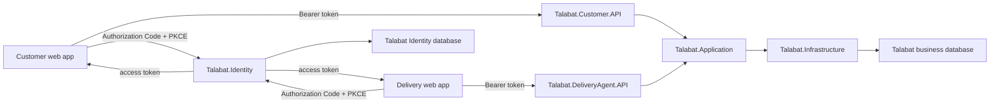

# Superseded Phase 4.5 Identity/Auth Foundation Plan

> **Superseded on 2026-07-14.** Do not use this document as the active implementation order. The approved direction now starts a minimal, separate `Talabat.Identity` host before the business APIs. Use `PROJECT_IMPLEMENTATION_ROADMAP.md` and `docs/phase-6-minimal-identity-auth-manual-setup-guide.md`. The material below is retained only as historical design analysis.

## 1. Decision

Do **not** add Duende IdentityServer or ASP.NET Core Identity to `Talabat.Infrastructure`.

Do **not** create `Talabat.Identity` as part of Phase 4.5 as Phase 4.5 is currently defined in the roadmap.

The correct boundary is:

- Phase 4.5 defines the authentication and authorization contract before business API endpoints exist.
- `Talabat.Application` receives only a small framework-neutral current-user abstraction.
- Each API host owns access-token validation, authorization policies, and its adapter from claims to the current-user abstraction.
- A later, separate ASP.NET Core host named `Talabat.Identity` owns Duende IdentityServer, ASP.NET Core Identity, accounts, credentials, login/logout, consent, token issuance, and Identity-specific persistence.
- `Talabat.Infrastructure` continues to own the business database and business repository implementations only.

The answer is therefore not “put Identity in Infrastructure” and not “put all of Phase 4.5 in a new IdentityServer project.” Authentication is a cross-boundary capability, and each concern belongs in the layer that consumes or owns it.

## 2. Repository Status And Scope Gate

The repository currently says:

- Phase 4 is complete.
- Phase 4.5 is `Next`.
- The active spec-kit and constitution still point to Phase 4 Persistence and Infrastructure.
- The current constitution says that no current-user abstraction or Identity/Auth implementation is allowed before the Identity phase.

This means the roadmap and active spec-kit context are temporarily out of sync. Before implementing even the neutral `ICurrentUser` interface, create and approve a Phase 4.5 spec-kit and update the constitution's current-phase scope. Otherwise the implementation would violate the active Phase 4 guard even though the roadmap now asks for it.

If “Phase 4.5 is complete” was intended literally, verify it against the Definition of Done in section 12. At the time this plan was written, the expected Phase 4.5 files were not present in production code.

## 3. Mentor Advice Versus “API First” Advice

Both recommendations contain a useful idea, but neither is optimal when applied literally.

The mentor is right that API routes, ownership rules, roles, policies, scopes, and `401`/`403`/`404` behavior must be designed before controllers are built. Otherwise an API can accidentally trust a caller-provided `customerId` or `deliveryAgentId`, and correcting that later changes routes and contracts.

The “API first” recommendation is right that a complete Identity portal should not be built before its audiences, scopes, clients, profile boundaries, and protected operations are known. Doing so tends to produce speculative roles, claims, and token configuration.

The best sequence for this project is a vertical security slice:

1. Define the auth contract in Phase 4.5.
2. Create a thin API shell with policies and one protected smoke endpoint, but no large business endpoint set.
3. Create a minimal, separate `Talabat.Identity` host and prove Authorization Code + PKCE and API token validation end to end.
4. Build the customer and delivery API endpoints using the proven security path.
5. Finish account-management and portal features after the protected APIs are stable.

This gives the APIs an auth-first shape while avoiding a large Identity implementation with no real consumer.

## 4. Recommended Target Architecture



The web applications authenticate with `Talabat.Identity`. They call the APIs with access tokens. The APIs validate tokens and enforce policies. Application handlers and Domain aggregates remain independent from ASP.NET Core, Duende, JWT, and claims.

### 4.1 Ownership By Project

| Concern | Correct owner | Must not be placed in |
|---|---|---|
| Business invariants and profile behavior | `Talabat.Domain` | Identity host, API policies |
| Framework-neutral current-user contract | `Talabat.Application` | Domain |
| Use-case ownership checks using trusted profile IDs | `Talabat.Application` | Controllers alone |
| Business EF mappings and repositories | `Talabat.Infrastructure` | Identity host |
| Token validation and `ClaimsPrincipal` mapping | Customer/Delivery API host | Domain, Application, business Infrastructure |
| API authorization policies | The API host that protects the resource | Identity host, Domain |
| Accounts, passwords, lockout, roles, account claims | `Talabat.Identity` with ASP.NET Core Identity | `Customer` or `DeliveryAgent` aggregates |
| OIDC/OAuth2 endpoints and token issuance | `Talabat.Identity` with Duende IdentityServer | Business API, business Infrastructure |
| Identity and operational-store migrations | `Talabat.Identity` | `Talabat.Infrastructure/Persistence/Migrations` |
| Customer/account and agent/account linkage | Business profile model plus an approved mapping workflow | EF navigation to `IdentityUser` |

### 4.2 Dependency Rules

- `Talabat.Domain` references nothing outward.
- `Talabat.Application` references Domain and no authentication framework.
- `Talabat.Infrastructure` implements business persistence contracts and does not reference `Talabat.Identity`.
- Customer and Delivery API hosts reference Application and Infrastructure as composition roots.
- `Talabat.Identity` is an independent web host. It must not be referenced by Domain, Application, Infrastructure, or either API project.
- Runtime integration between the Identity host and APIs uses OIDC/OAuth2 metadata and tokens, not project references.

## 5. Phase 4.5 Scope

Phase 4.5 is a small contract-and-boundary phase. It should make future APIs auth-shaped without implementing authentication infrastructure.

### In scope

- Approve the account-versus-domain-profile separation.
- Define users, active roles, policy names, API resources, scopes, audiences, and stable claim meanings.
- Define public versus authenticated endpoints.
- Define `/api/me/...` routes for owner-scoped operations.
- Define `401`, `403`, and ownership-safe `404` behavior.
- Add one framework-neutral `ICurrentUser` interface to Application.
- Produce the endpoint authorization matrix.
- Define the development and integration-test authentication approach for Phase 5.
- Add architecture tests or source guards proving no framework types leaked inward.

### Out of scope

- Duende or ASP.NET Core Identity packages.
- `Talabat.Identity` project creation.
- JWT bearer package installation or production token validation.
- Login, registration, logout, refresh-token, consent, email, reset-password, 2FA, or external-login flows.
- `ApplicationUser`, `IdentityRole`, `IdentityDbContext`, Identity migrations, or Duende stores.
- `IdentityUserId` changes to `Customer` or `DeliveryAgent`.
- Repository interface changes.
- API controllers, endpoints, or a development authentication handler.
- Any Domain business-rule change.

## 6. Phase 4.5 Security Contract

### 6.1 Account And Profile Model

An account authenticates a human. A domain profile represents that human in a business role.

- `ApplicationUser.Id` will later be the stable OIDC `sub` value.
- `Customer.Id` remains the integer key used by customer business use cases.
- `DeliveryAgent.Id` remains the integer key used by delivery business use cases.
- A user may eventually have more than one business role/profile, so account ID and profile ID must not be treated as the same value.
- Passwords, lockout state, confirmation state, security stamps, recovery codes, and external-login data never belong in Domain entities.

The exact persisted account-to-profile linkage is a later Identity implementation decision. Phase 4.5 records the semantic relationship but does not add columns or migrations.

### 6.2 Resource, Scope, Role, And Policy Names

Use distinct names for audiences/resources and scopes:

| Type | Customer API | Delivery API |
|---|---|---|
| API resource / audience | `talabat.customer-api` | `talabat.deliveryagent-api` |
| Access scope | `talabat.customer-api.access` | `talabat.deliveryagent-api.access` |
| Primary role | `Customer` | `DeliveryAgent` |
| Primary policy | `CustomerAccess` | `DeliveryAgentAccess` |

Reserve `DeliveryOperations`, `Admin`, and `RestaurantOwner` only as candidate names. Do not create roles with no approved use cases. In particular, do not introduce `RestaurantOwner` until restaurant ownership exists in the business model.

Policies should require all of the following where applicable:

1. An authenticated identity.
2. The expected API scope.
3. The expected business role or permission.
4. An owner match inside the Application use case for owner-scoped resources.

Roles do not replace scopes, and neither roles nor scopes replace ownership checks.

### 6.3 Claim Contract

Use standard claims where standards already define the meaning:

| Claim | Meaning | Rule |
|---|---|---|
| `sub` | Stable account ID | Required for an authenticated user; never an email address |
| `scope` | Granted API access scopes | Required by API policies |
| `role` | Coarse business role | Used by API policy, not as a Domain invariant |
| `client_id` | Calling OAuth client | Useful for diagnostics and client restrictions |

Do not make email, phone number, display name, or mutable username the account-to-profile key.

The preferred long-term design is for APIs to map the stable `sub` to a business profile through an approved profile-link mechanism. If profile IDs are later emitted as token claims for performance, treat them as optional denormalized authorization data, issue them only after a successful link, validate their presence for the matching policy, and reissue tokens when the link changes.

### 6.4 Current-User Abstraction

The Application abstraction must not mention `HttpContext`, `ClaimsPrincipal`, `Claim`, JWT, Duende, or ASP.NET Core Identity. A suitable initial shape is:

```csharp
namespace Talabat.Application.Abstractions;

public interface ICurrentUser
{
    bool IsAuthenticated { get; }
    string? SubjectId { get; }
    int? CustomerId { get; }
    int? DeliveryAgentId { get; }
    IReadOnlySet<string> Roles { get; }
}
```

Design notes:

- Phase 4.5 adds the interface only; it does not wire or consume it.
- The API adapter later translates validated claims and the approved profile link into this framework-neutral view.
- API policies make the coarse role/scope decision.
- Application use cases continue to enforce resource ownership using the trusted `CustomerId` or `DeliveryAgentId` supplied by the adapter.
- Existing handlers do not need an ambient dependency merely because the interface exists. In Phase 5, the API may use `ICurrentUser` to construct the existing explicit-ID Application requests.
- If asynchronous profile resolution is required, introduce a separate explicit resolver contract in the later Identity integration spec instead of performing database I/O inside property getters.

### 6.5 Routes And Status Codes

- Public identifiers such as `restaurantId` and `productId` may remain in public resource routes.
- Owner identity must not be accepted from public route or body data.
- Customer-owned endpoints use `/api/me/...`.
- Delivery-agent-owned endpoints use `/api/me/deliveries/...` in the Delivery API host.

Response semantics:

| Situation | Response |
|---|---|
| Missing, expired, malformed, or invalid token | `401 Unauthorized` |
| Valid token but missing required scope/role | `403 Forbidden` |
| Owner-scoped resource does not exist or belongs to another profile | `404 Not Found` |
| Valid caller violates a business-state invariant | Existing mapped `409 Conflict` or other approved Application mapping |

Returning `404` for another user's resource avoids confirming that the resource exists. It must not be used to hide a simple missing-role failure, which remains `403`.

## 7. Initial Endpoint Authorization Matrix

This matrix is the Phase 4.5 input to the detailed Phase 5 and Phase 7 API specs. Exact HTTP verbs or names may change during those API specs, but the access and ownership rules should not.

### 7.1 Customer API

| Planned operation | Proposed route | Access | Ownership rule |
|---|---|---|---|
| Browse restaurants | `GET /api/restaurants` | Anonymous | None |
| View restaurant menu | `GET /api/restaurants/{restaurantId}/menu` | Anonymous | None |
| Get current cart | `GET /api/me/cart` | `CustomerAccess` | Use token-derived customer profile only |
| Add cart item | `POST /api/me/cart/items` | `CustomerAccess` | Use token-derived customer profile only |
| Update cart item | `PUT /api/me/cart/items/{productId}` | `CustomerAccess` | Cart must belong to current customer |
| Remove cart item | `DELETE /api/me/cart/items/{productId}` | `CustomerAccess` | Cart must belong to current customer |
| Clear cart | `DELETE /api/me/cart` | `CustomerAccess` | Cart must belong to current customer |
| Get profile | `GET /api/me/profile` | `CustomerAccess` | Current customer only |
| Update profile | `PUT /api/me/profile` | `CustomerAccess` | Current customer only |
| Add address | `POST /api/me/addresses` | `CustomerAccess` | Current customer only |
| Remove address | `DELETE /api/me/addresses/{addressId}` | `CustomerAccess` | Address must belong to current customer |
| Set default address | `PUT /api/me/addresses/{addressId}/default` | `CustomerAccess` | Address must belong to current customer |
| Checkout | `POST /api/me/checkout` | `CustomerAccess` | Cart and address must belong to current customer |
| Order history | `GET /api/me/orders` | `CustomerAccess` | Existing customer-scoped repository read |
| Order details | `GET /api/me/orders/{orderId}` | `CustomerAccess` | Existing owner-scoped read; other owner returns `404` |

Catalog browsing should remain intentionally anonymous unless the product requirements explicitly require sign-in. Applying authorization to every controller by default is safe only when public endpoints are explicitly marked anonymous and covered by tests.

### 7.2 Delivery API

| Planned operation | Proposed route | Access | Ownership rule |
|---|---|---|---|
| Get agent profile | `GET /api/me/profile` | `DeliveryAgentAccess` | Current delivery-agent profile only |
| Set online/offline status | `PUT /api/me/status` | `DeliveryAgentAccess` | Current delivery agent only |
| Update location | `PUT /api/me/location` | `DeliveryAgentAccess` | Current delivery agent only |
| List assigned deliveries | `GET /api/me/deliveries` | `DeliveryAgentAccess` | Assigned to current agent only |
| Get assigned delivery | `GET /api/me/deliveries/{deliveryId}` | `DeliveryAgentAccess` | Assigned to current agent; otherwise `404` |
| Accept an available delivery | To be decided in Phase 7 | `DeliveryAgentAccess` | Only if self-assignment is approved |
| Mark arrived/picked-up/out-for-delivery/delivered | `POST /api/me/deliveries/{deliveryId}/...` | `DeliveryAgentAccess` | Assigned to current agent plus Domain transition rules |
| Assign delivery to an agent | Operations route to be decided | `DeliveryOperationsAccess` | Not an agent self-service action unless Phase 7 chooses that model |
| Cancel/fail delivery | Route to be decided | Policy depends on actor | Actor permission plus Domain transition rules |

The unresolved Delivery operations are genuine Phase 7 product decisions. Phase 4.5 must not invent Domain behavior simply to complete the matrix.

## 8. Detailed Phase 4.5 Implementation Plan

### Stage A: Activate The Correct Planning Scope

#### P45-001 — Create the Phase 4.5 spec-kit

- Create a new feature spec directory rather than editing `specs/002-persistence-infrastructure`.
- Use a name such as `specs/003-identity-auth-foundation/`.
- Include spec, plan, research, contracts, quickstart, and tasks artifacts.
- Treat this document and the current roadmap as inputs.

**Exit check:** Phase 4's completed artifacts remain unchanged.

#### P45-002 — Update the constitution and `AGENTS.md`

- Change only the current-phase scope section; keep permanent architecture principles intact.
- Allow framework-neutral auth contracts and documentation.
- Continue to prohibit Duende, ASP.NET Core Identity, JWT bearer, Identity migrations, API endpoints, Domain changes, and repository interface changes.
- Point `AGENTS.md` at the new Phase 4.5 spec-kit.

**Dependency:** P45-001.

**Exit check:** Adding `ICurrentUser` is explicitly allowed by the active scope guard.

### Stage B: Freeze The Auth Contract

#### P45-003 — Approve account/profile separation

- Record that `sub` identifies an account, not a Customer or DeliveryAgent aggregate.
- Record that business use cases continue to use integer profile IDs.
- Defer the persisted profile-link design to the Identity implementation phase.

#### P45-004 — Approve naming constants

- Approve the two audiences, two access scopes, current roles, and current policies from section 6.
- Keep these names in documentation during Phase 4.5; add code constants in the API host when policies are implemented.
- Do not place API policy constants in Domain.

#### P45-005 — Review the endpoint matrix

- Validate every planned Phase 5 and Phase 7 operation.
- Mark catalog reads anonymous deliberately.
- Mark every owner-scoped operation with its trusted profile source.
- Leave unapproved Delivery assignment behavior unresolved rather than guessing.

#### P45-006 — Approve route and error conventions

- Approve `/api/me/...` for owner-scoped resources.
- Reject public `customerId` and `deliveryAgentId` parameters.
- Lock `401`, `403`, and ownership-safe `404` semantics.

### Stage C: Add The Thin Application Seam

#### P45-007 — Add `ICurrentUser`

- Create `src/Talabat/Talabat.Application/Abstractions/ICurrentUser.cs`.
- Keep the interface framework-neutral.
- Do not register an implementation.
- Do not inject it into existing handlers in this phase.
- Do not alter handler requests or repository interfaces.

**Dependencies:** P45-003 through P45-006.

#### P45-008 — Add contract and architecture tests

Add focused tests that prove:

- `Talabat.Application` still has no ASP.NET Core, Identity, Duende, or JWT package reference.
- `ICurrentUser` exposes no framework type.
- `Talabat.Domain` remains unchanged and package-free.
- No current business handler consumes `ICurrentUser` yet.

Prefer a compile-time/reflection architecture test or a narrow source guard over tests that merely duplicate the interface text.

### Stage D: Define Safe Development Authentication For Phase 5

#### P45-009 — Choose the Phase 5 development mechanism

Recommended order of preference:

1. Use JWT bearer validation plus `dotnet user-jwts` for manual local API testing. Microsoft documents this specifically for local development.
2. Use a test-only `AuthenticationHandler` injected through the integration-test host for deterministic `401`/`403`/ownership tests.
3. Avoid a custom development handler in the production API pipeline unless it is compiled or registered only in Development and fails closed everywhere else.

The development token/test principal must use the same claim names and policy inputs planned for Duende. Never create a home-grown token issuer for production.

This task produces a documented Phase 5 decision only; it installs and wires nothing in Phase 4.5.

### Stage E: Verify And Close Phase 4.5

#### P45-010 — Run quality gates

- Build the solution.
- Run Application and Infrastructure tests.
- Run the package vulnerability audit.
- Verify no Identity/Auth packages were added.
- Verify no new EF migration exists.
- Verify no Domain or repository contract changed.
- Verify all owner routes in the matrix avoid caller-supplied profile IDs.

#### P45-011 — Record completion

- Write a short Phase 4.5 completion record.
- Mark Phase 4.5 complete in the roadmap only after all checks pass.
- Change the active constitution/agent scope to the next approved phase; do not leave the Phase 4.5 guard active during API implementation.

## 9. Recommended Project Order After Phase 4.5

The current roadmap can be improved by splitting the later Identity phase into a foundation slice and a portal-completion slice.

### Phase 5A — API shell

1. Rename the empty `Talabat.API` host to `Talabat.Customer.API` before adding controllers.
2. Add Application DI registration, Problem Details/exception mapping, API versioning decision, OpenAPI, and health checks.
3. Add JWT bearer validation, fallback authorization, `CustomerAccess`, and explicit anonymous catalog policy behavior.
4. Add the API implementation of `ICurrentUser`.
5. Add one protected `/api/me/security-check` or equivalent test-only smoke route.
6. Prove `401`, `403`, and a successful authenticated request using development tokens.

Do not build the full endpoint set yet.

### Phase 8A — Minimal real Identity foundation, moved earlier

Create the separate `Talabat.Identity` host at this point, because the API now gives it a real audience and policy contract.

Implement only:

- Supported Duende IdentityServer for .NET 10; as of July 2026, Duende IdentityServer 8 is the current .NET 10 line.
- ASP.NET Core Identity user store through `AddAspNetIdentity`.
- Customer web client as a public OIDC client using Authorization Code + PKCE and no browser-held client secret.
- Customer API resource, scope, and audience.
- Development signing credentials only for local development; approved protected credentials for deployed environments.
- Identity user database and durable Duende operational store.
- One development Customer account/profile link.
- End-to-end login, token issuance, discovery, API validation, and a protected smoke request.

Do not implement the entire account portal in this slice.

### Phase 5B — Customer business API

- Implement public catalog endpoints.
- Implement protected cart, profile, address, checkout, and order endpoints.
- Resolve current profile IDs from trusted auth context, never public request data.
- Add endpoint-level integration tests for anonymous access, `401`, `403`, owner success, and cross-owner `404`.

### Phase 6 — Customer backend contract stabilization

- Complete pagination, filtering, response contracts, and customer workflow testing.
- Keep the Customer API contract stable for the future website.

### Phase 7 — Delivery Application and API

- Decide manual assignment versus self-acceptance before endpoints.
- Add Delivery Application use cases.
- Create `Talabat.DeliveryAgent.API` as a separate host.
- Add its resource, scope, audience, policy, current-user adapter, and protected endpoints.
- Add a Delivery web client to Identity only when that client exists or an end-to-end integration test requires it.

### Phase 8B — Complete the Identity/Auth portal

- Registration and idempotent domain-profile provisioning.
- Email confirmation and password reset.
- Lockout and password policy.
- Optional 2FA and external login only when required.
- Logout, consent, session, and refresh-token policy.
- Production signing-key management, data protection, secret storage, operational cleanup, monitoring, and backup.
- Licensing approval before production deployment.

### Phase 9 — Authorization hardening and audit

- Reconcile every implemented endpoint with the matrix.
- Add operations/admin policies only for approved use cases.
- Test token audience isolation between Customer and Delivery APIs.
- Verify all owner-scoped access uses trusted current profile IDs.
- Review logging to ensure tokens, passwords, codes, and sensitive claims are never logged.

## 10. Future `Talabat.Identity` Project Design

When Phase 8A is approved, create one dedicated ASP.NET Core web project initially. Do not put these files in `Talabat.Infrastructure`.

```text
src/Talabat/Talabat.Identity/
|-- Talabat.Identity.csproj
|-- Program.cs
|-- Identity/
|   |-- ApplicationUser.cs
|   `-- ApplicationRoleNames.cs
|-- Data/
|   |-- IdentityDbContext.cs
|   |-- Migrations/
|   `-- Seed/
|-- Configuration/
|   |-- Clients.cs
|   |-- ApiResources.cs
|   |-- ApiScopes.cs
|   `-- IdentityResources.cs
|-- Pages/
|   `-- Account/
`-- Security/
    `-- ProfileService.cs          # only if claims beyond AddAspNetIdentity are required
```

For this project's current scale:

- Keep client/resource/scope configuration in reviewed code or configuration because there are only a few known clients and APIs.
- Persist ASP.NET Core Identity users in SQL Server.
- Persist Duende operational data such as authorization codes, refresh tokens, and consent. Duende supports an EF operational store independently from its EF configuration store.
- Prefer a separate `TalabatIdentityDb` connection from the business `TalabatDb`. If one physical database is required for local simplicity, use separate schemas, separate DbContexts, and separate migration histories.
- Never let Identity migrations enter the business `TalabatDbContext` migration folder.
- Keep IdentityServer configuration and operational migrations owned by the Identity host.

Before creating the project, confirm Duende licensing. Development, test, and personal use do not require a production license; production requires a valid license, with Community Edition available only when its current eligibility rules are met.

## 11. Verification Strategy

### Phase 4.5 tests

- Architecture boundary tests.
- Full build and existing tests.
- Package and migration guard checks.
- Human review of the authorization matrix.

### API-shell tests

- Anonymous request to a protected endpoint returns `401`.
- Authenticated token with wrong scope or role returns `403`.
- Correct token reaches the smoke endpoint.
- Public catalog operation remains accessible anonymously.
- Test authentication handler exists only in the integration-test host.

### Real Identity integration tests

- Discovery document is reachable over the expected authority.
- Authorization Code + PKCE succeeds for the registered redirect URI.
- Access token contains the correct issuer, audience, scope, subject, and role inputs.
- Customer token succeeds against Customer API.
- Customer token fails against Delivery API.
- Invalid issuer, invalid audience, invalid signature, and expired token return `401`.
- Cross-customer resource access returns `404`.
- Logout/revocation/refresh behavior follows the approved session policy.

## 12. Phase 4.5 Definition Of Done

Phase 4.5 is complete only when all of the following are true:

- [ ] A dedicated Phase 4.5 spec-kit is approved and active.
- [ ] Constitution and `AGENTS.md` point to Phase 4.5, not completed Phase 4.
- [ ] Account and business-profile separation is documented.
- [ ] Audiences, scopes, current roles, policies, and claim meanings are approved.
- [ ] The endpoint matrix covers every planned Phase 5 and Phase 7 operation, with unresolved product decisions explicitly marked.
- [ ] Owner-scoped routes do not accept `customerId` or `deliveryAgentId`.
- [ ] `401`, `403`, and owner-safe `404` behavior is fixed.
- [ ] `ICurrentUser` exists only as a framework-neutral Application interface.
- [ ] Existing handlers, Domain entities, repository contracts, and migrations are unchanged.
- [ ] No Duende, ASP.NET Core Identity, or JWT bearer package was added.
- [ ] No `Talabat.Identity` project exists yet.
- [ ] Development and integration-test authentication approaches for Phase 5 are documented.
- [ ] The solution builds and all existing tests pass.
- [ ] The package vulnerability audit passes.
- [ ] A completion record is written and the next phase scope is activated.

## 13. Mistakes To Avoid

- Do not use the archived IdentityServer4 package. The selected supported successor is Duende IdentityServer.
- Do not build a custom production JWT issuer.
- Do not use an ID token to call an API; APIs receive access tokens.
- Do not use Resource Owner Password Credentials for the browser applications. Use Authorization Code + PKCE.
- Do not store a client secret in a browser-based application.
- Do not trust profile IDs sent by the caller.
- Do not use roles as a substitute for ownership checks or Domain invariants.
- Do not expose `ClaimsPrincipal` or `HttpContext` to Application or Domain.
- Do not add an EF relationship from business entities to `IdentityUser`.
- Do not place Identity tables in `TalabatDbContext`.
- Do not let a development auth bypass be enabled by production configuration.
- Do not require authentication for public catalog browsing accidentally; public access must be explicit and tested.

## 14. Official References

- [Duende IdentityServer supported versions](https://docs.duendesoftware.com/general/support-and-issues/)
- [Duende IdentityServer ASP.NET Core Identity integration](https://docs.duendesoftware.com/identityserver/aspnet-identity/)
- [Duende resources, API resources, and scopes](https://docs.duendesoftware.com/identityserver/fundamentals/resources/)
- [Duende data stores and persistence](https://docs.duendesoftware.com/identityserver/data/)
- [Duende EF Core configuration and operational stores](https://docs.duendesoftware.com/identityserver/data/ef/)
- [Duende deployment guidance](https://docs.duendesoftware.com/identityserver/deployment/)
- [Duende Community Edition eligibility](https://duendesoftware.com/products/communityedition)
- [Microsoft: configure JWT bearer authentication in ASP.NET Core](https://learn.microsoft.com/en-us/aspnet/core/security/authentication/configure-jwt-bearer-authentication?view=aspnetcore-10.0)
- [Microsoft: authentication and authorization in Minimal APIs, including `dotnet user-jwts`](https://learn.microsoft.com/en-us/aspnet/core/fundamentals/minimal-apis/security?view=aspnetcore-10.0)
- [Microsoft: ASP.NET Core integration testing and test authentication handlers](https://learn.microsoft.com/en-us/aspnet/core/test/integration-tests?view=aspnetcore-10.0)
