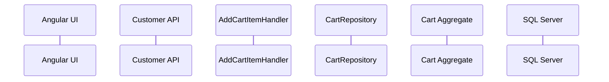
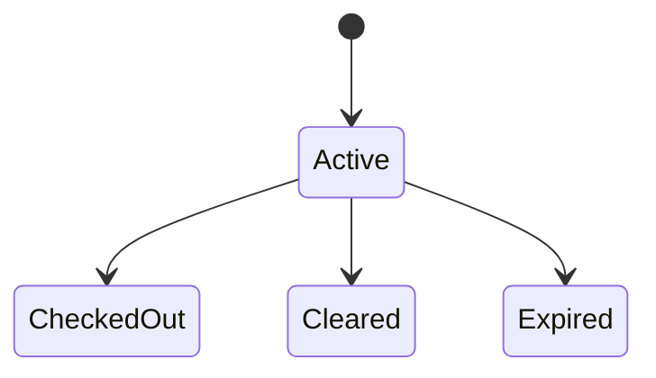

# OpenCode Task — Create a Deep Educational Guide for the Expired Cart Lifecycle Bug

Act as a senior .NET backend engineer, Domain-Driven Design mentor, EF Core mentor, Clean Architecture reviewer, and code teacher.

Your task is **not to fix the bug**. The bug has already been fixed and manually verified.

Your task is to inspect the actual Talabat backend repository, compare the expired-cart fix against the pre-fix implementation, read every affected source file and test, then create a detailed **learning document** that teaches me exactly:

- what the bug was;
- why it happened;
- why it affected old accounts but not new ones;
- why sign-out/sign-in did not fix it;
- how the bug travelled through the system;
- how the fix works;
- why every changed file was needed;
- why every changed handwritten code line was added/removed/modified;
- how the changed files work together;
- what backend/DDD/EF Core lessons I should learn from this bug;
- how I could detect and prevent a similar bug in the future.

I am still learning backend architecture, so explain difficult concepts from first principles, but do not oversimplify the actual implementation.

---

# Repository

Work in the Talabat backend repository.

Expected location:

```text
D:\link-dev\talabat
```

Do not work in the Angular repository for this task.

---

# Important scope rule

This is a **read + analyze + teach** task.

Do not:

- change production code;
- change tests;
- create another migration;
- fix unrelated failing tests;
- modify Angular;
- modify generated OpenAPI files;
- perform unrelated refactors;
- clean up formatting unrelated to this bug.

The only file you should create is:

```text
docs/expired-cart-lifecycle-fix-learning-guide.md
```

If `docs` does not exist, create it.

---

# Known bug symptoms

Before the fix:

- Newly created customer accounts could add products to the cart normally.
- Older customer accounts often could not add products.
- The UI showed that the cart was expired.
- `POST /api/me/cart/items` returned `409 Conflict`.
- Signing out and signing back in did not solve the issue.
- Multiple old accounts reproduced the same issue.

The root cause reported after investigation was approximately:

```text
Old accounts already had historical/non-mutable cart records.

The old add-item flow retrieved a cart for the customer without requiring
that cart to have Status == Active.

Therefore a CheckedOut/Cleared/Expired cart could be returned.

AddCartItemHandler then called Cart.AddItem(...).

The Cart aggregate correctly rejected mutation of the non-active cart.

The exception became HTTP 409.

There was no transition that created a fresh Active cart.

Therefore the customer remained stuck forever on the old non-mutable cart.
```

The old execution path was reported approximately as:

```text
POST /api/me/cart/items
    ↓
CartRepository returns an existing non-active cart for CustomerId
    ↓
AddCartItemHandler calls Cart.AddItem(...)
    ↓
Cart aggregate throws CartExpiredException / equivalent
    ↓
API returns 409 Conflict
    ↓
no new active cart is created
```

The corrected flow was reported approximately as:

```text
POST /api/me/cart/items
    ↓
CartRepository.GetActiveCartByCustomerIdAsync(...)
    ↓
no active cart found
    ↓
handler creates a new Cart
    ↓
adds the first item
    ↓
SaveChanges
    ↓
API returns 200 with the new active cart
```

Additionally, if an Active cart is already beyond its expiry window:

```text
handler detects expiry
    ↓
marks old cart Expired
    ↓
persists it
    ↓
creates a fresh Active cart
    ↓
adds the requested item
```

Do not blindly trust the summary above.

Verify all class names, method names, status values, exceptions, SQL constraints, and behavior against the real repository.

---

# Known manually verified result

After the fix, an old affected account was tested.

Before:

```text
POST /api/me/cart/items
→ 409
```

After:

```text
POST /api/me/cart/items
→ 200
```

The database reportedly contained historical carts such as:

```text
Cleared
CheckedOut
Expired
```

and after the request:

```text
old historical carts remained intact
+
exactly one new Active cart was created
+
the new product belonged to that Active cart
```

Cross-restaurant behavior still produced the expected conflict.

A newly created account still worked normally.

---

# Reported changed areas

Use Git to discover the **exact** changed files.

The fix reportedly involved files around:

```text
src/Talabat/Talabat.Domain/Aggregates/Basket/CartStatus.cs
src/Talabat/Talabat.Domain/Aggregates/Basket/Cart.cs

src/Talabat/Talabat.Application/Basket/AddItem/AddCartItemHandler.cs
src/Talabat/Talabat.Application/Basket/GetCart/GetCartHandler.cs

src/Talabat/Talabat.Infrastructure/Persistence/Configurations/CartConfiguration.cs
src/Talabat/Talabat.Infrastructure/Persistence/UnitOfWork.cs
```

and an EF Core migration similar to:

```text
20260807105019_AddCartExpiredStatus.cs
20260807105019_AddCartExpiredStatus.Designer.cs
<ModelSnapshot>.cs
```

and tests in areas similar to:

```text
tests/Talabat.Domain.Tests/Basket/
tests/Talabat.Application.Tests/Basket/
tests/Talabat.Infrastructure.Tests/Persistence/
tests/Talabat.Customer.API.Tests/
```

Do not assume this list is complete.

Use Git to determine the actual changed-file list.

---

# Step 1 — Find the exact fix diff

Before writing the learning guide, inspect Git.

Determine whether the fix is:

- still uncommitted; or
- already committed.

If uncommitted, inspect:

```bash
git status
git diff
git diff --stat
```

If committed, identify the relevant commit and inspect:

```bash
git log
git show <commit>
git diff <commit-before>..<fix-commit>
```

Your explanation must be based on the actual fix diff, not only the final version of the files.

Ignore unrelated repository modifications.

---

# Step 2 — Read the surrounding architecture

For every changed file, read enough surrounding code to understand its role.

Also inspect directly related code such as:

- Cart repository interface;
- Cart repository implementation;
- Cart aggregate;
- CartItem;
- CartStatus;
- domain exceptions;
- AddCartItem request/command;
- AddCartItemHandler;
- GetCartHandler;
- API endpoint;
- exception/error mapping;
- UnitOfWork;
- DbContext;
- Cart EF configuration;
- indexes and constraints;
- checkout/cart-clearing code;
- tests.

The guide should explain the architecture around the change, not only isolated diff lines.

---

# Required output file

Create:

```text
docs/expired-cart-lifecycle-fix-learning-guide.md
```

The document should be detailed enough that I can later use it as a study chapter.

---

# Required structure of the learning guide

## 1. The bug in simple language

Explain what the user experienced.

Explain:

- what worked;
- what failed;
- why new accounts worked;
- why old accounts failed.

Use a very simple example such as:

```text
New customer:
No old cart → new Active cart → add succeeds.

Old customer:
Historical cart exists → wrong cart selected → mutation rejected → 409.
```

Then explain the technical version.

---

## 2. What a Cart represents in this project

Teach me the relevant domain model before explaining the bug.

Explain:

- Cart as an Aggregate Root;
- CartItem;
- CartStatus;
- customer ownership;
- restaurant invariant;
- mutable vs non-mutable cart;
- expiry;
- checkout;
- clear;
- historical carts.

Explain these DDD terms using this project:

```text
Aggregate
Aggregate Root
Entity
Invariant
Domain rule
Domain exception
Lifecycle
Repository
Unit of Work
Persistence
Application layer
Infrastructure layer
```

Do not only give dictionary definitions.

Show how each concept exists in the actual Talabat code.

---

## 3. Where the bug lived architecturally

Explain whether this was primarily:

- Domain;
- Application;
- Infrastructure;
- Database;
- API;
- Frontend;

or a combination.

Explain why the visible Angular error did not mean Angular caused the bug.

---

## 4. Full request flow before the fix

Trace the actual request:

```text
Angular
→ POST /api/me/cart/items
→ Customer API endpoint
→ AddCartItem command/request
→ AddCartItemHandler
→ repository
→ SQL database
→ Cart aggregate
→ exception
→ API error mapping
→ HTTP 409
```

Use actual class and method names.

For each step explain:

1. What happened?
2. What data entered this layer?
3. What did the layer return?
4. Where did the wrong decision occur?

Include a Mermaid sequence diagram.

Example structure:



Use the actual project behavior.

---

## 5. Why sign-out/sign-in could never fix it

This section is very important.

Teach me the difference between:

```text
Authentication/session state
```

and:

```text
Persisted domain state
```

Explain where these things live:

| State | Example | Lives where? |
|---|---|---|
| Login state | access token | auth/browser/memory |
| User identity | CustomerId mapping | backend/auth |
| Cart status | Active/Expired/etc. | SQL database |
| Cart items | Product and quantity | SQL database |

Explain why changing authentication state does not delete or repair persisted cart records.

---

## 6. Exact root cause

State the root cause precisely.

Do not say only:

```text
The cart was expired.
```

Explain:

- what the repository used to retrieve;
- what condition was missing;
- why historical carts were eligible;
- what the handler assumed;
- what the aggregate did correctly;
- why no recovery path existed.

Separate:

### Primary root cause

### Contributing design problem

### Persistence/schema problem

### Missing test coverage

if those distinctions exist in the actual implementation.

---

## 7. Before vs after repository behavior

Show the actual old query and the new query.

For example, if the code changed conceptually from:

```csharp
GetCartByCustomerIdAsync(customerId)
```

to:

```csharp
GetActiveCartByCustomerIdAsync(customerId)
```

explain exactly why this changes the semantics.

Explain:

- why `CustomerId` alone is insufficient when historical carts exist;
- why `Status == Active` is important;
- what `null` means now;
- why `null` does not necessarily mean an error;
- why it can mean "this user has no current shopping session".

---

## 8. Corrected lifecycle

Explain the new algorithm.

Write pseudocode such as:

```text
Get active cart for customer

if no Active cart:
    create new Active cart

else if Active cart is expired:
    mark it Expired
    save it
    create new Active cart

add item
save
return cart
```

But first derive this pseudocode from the actual implementation.

Then explain each branch.

---

## 9. Cart state machine

Use the actual `CartStatus` enum and aggregate rules.

Create a Mermaid state diagram using only real states/transitions.

For example:



If the real code differs, use the real code.

Explain:

- which states allow mutation;
- which do not;
- which states are historical/final;
- whether any state can transition back to Active.

Explain why creating a new cart is usually different from reviving a historical cart.

---

# 10. File-by-file deep explanation

This is the most important section.

Create one subsection for **every changed file**.

For every file include all of the following.

---

### File: `<actual path>`

#### Which layer is this file in?

Example:

```text
Domain
Application
Infrastructure
API
Tests
EF migration
```

#### What is this file's responsibility?

Explain what it did before this fix.

#### What changed?

Show the relevant before and after code or a focused diff.

#### Explain every changed handwritten line

For **every changed handwritten logical line** explain:

1. What does this C# code mean?
2. Why was it changed?
3. What bug does it prevent?
4. What would happen if this line did not exist?
5. How does it connect to another file in the fix?

This requirement is mandatory.

Do not skip lines just because they look simple.

For example, if this line exists:

```csharp
Expired = 4
```

do not merely write:

> Added Expired status.

Explain:

- how C# enum numeric values work;
- how EF Core stores enums;
- what `4` becomes in SQL;
- why old enum values must remain stable;
- why the SQL check constraint also needs to allow `4`;
- what happens if the C# code supports `4` but SQL Server rejects it.

---

# 11. CartStatus.cs deep dive

Explain:

- every enum member;
- persisted numeric values;
- `Expired`;
- why enum values should not casually be reordered after data exists;
- how EF maps the enum;
- relationship with the DB constraint.

---

# 12. Cart.cs deep dive

Explain the aggregate deeply.

Cover every relevant changed line.

Explain:

- mutable-state guards;
- AddItem restrictions;
- expiry calculation;
- CreatedAt;
- MarkExpired;
- checkout rules;
- clear rules;
- status transitions;
- CartExpiredException or actual exception used.

Explain the difference between:

```text
detecting that a cart is expired
```

and:

```text
persisting Status = Expired
```

Explain why the aggregate should reject invalid mutation even though the handler is now smarter.

---

# 13. AddCartItemHandler.cs line-by-line walkthrough

This should be one of the largest sections.

Walk through the complete method in execution order.

For every relevant statement explain:

- getting the current user/customer;
- retrieving the active cart;
- why the repository returns null;
- detecting time expiry;
- marking an old cart Expired;
- saving the expired state;
- creating a new Cart;
- adding the first item;
- restaurant validation;
- product validation;
- persistence;
- response mapping;
- error handling;
- concurrency behavior.

Show small snippets, then explain them.

Afterward, provide an English pseudocode version.

Then provide a "beginner mental model" version.

Example:

```text
Think of Active cart as the customer's current shopping session.

Historical carts are receipts/history, not reusable shopping baskets.
```

---

# 14. GetCartHandler.cs deep dive

Explain:

- why GetCart behavior needed modification;
- how read behavior differs from AddItem behavior;
- whether an expired cart is returned, marked, hidden, or treated as absent;
- why a GET handler normally should not create a new cart unless the actual code deliberately does so.

Explain the actual implementation.

---

# 15. CartConfiguration.cs and database constraint

Explain EF Core configuration.

Show the actual check constraint.

Explain conceptually using SQL:

```sql
CHECK (Status IN (...))
```

Teach:

- why a DB check constraint exists;
- why it is stronger than only trusting C#;
- why adding `Expired` to the C# enum is not enough;
- what SQL Server would do if code tried to write Status = 4 before the migration;
- why the constraint needs to match the domain enum.

---

# 16. EF Core migration deep dive

Explain the actual migration.

Cover:

### Up()

What changes when upgrading the DB?

### Down()

What happens if the migration is rolled back?

### Constraint replacement

Why was the old constraint dropped and recreated?

### Migration history

Explain `__EFMigrationsHistory`.

### Designer file

Explain what it is and why it is generated.

### ModelSnapshot

Explain what it represents.

For generated migration metadata:

- explain it by logical block;
- do not pretend every generated line has unique business meaning;
- clearly label generated vs handwritten code.

---

# 17. UnitOfWork.cs and concurrency

Explain every relevant changed line.

Teach me the real concurrency problem.

Example:

```text
Request A checks: no Active cart
Request B checks: no Active cart

A creates cart
B creates cart
```

Explain why this can happen even if both handlers contain correct `if (cart == null)` logic.

Then explain the real DB/index/UnitOfWork protection in this project.

Cover:

- unique constraint/index;
- SaveChanges;
- SQL Server violation;
- application concurrency exception;
- why the database is the final authority for uniqueness.

Use the actual implementation names.

---

# 18. API error mapping

Trace the old exception all the way to:

```text
HTTP 409 Conflict
```

Explain:

- domain exception;
- application propagation;
- middleware/filter/exception mapper;
- Problem Details;
- errorCode;
- frontend message.

Explain why `409` was a useful clue during debugging.

Also explain why `401` or `403` would have suggested a different problem.

---

# 19. Tests — one by one

Find every test added or changed for this fix.

Organize them as:

### Domain tests

### Application tests

### Infrastructure / persistence tests

### API integration tests

For every test:

1. show the test name;
2. explain Arrange;
3. explain Act;
4. explain Assert;
5. explain which production code it protects;
6. explain why it would fail before the fix;
7. explain why it passes after the fix.

Do not only summarize the test class.

Explain individual tests.

---

# 20. Why tests at multiple layers were useful

Teach the difference between:

```text
Domain unit test
Application handler test
Persistence integration test
API integration test
```

Explain what each type can catch that the others cannot.

Use examples from this fix.

---

# 21. How all changed files work together

Create a diagram like:

```text
CartStatus
    ↓
Cart aggregate
    ↓
AddCartItemHandler
    ↓
CartRepository
    ↓
EF CartConfiguration
    ↓
Migration
    ↓
SQL constraint
    ↓
UnitOfWork concurrency handling
    ↓
API
```

Explain the responsibility of each link.

Then provide "what if we forgot this file?" examples.

For example:

### If we changed the handler but not the aggregate

What risk remains?

### If we changed CartStatus but not the DB constraint

What happens?

### If we changed repository filtering but not concurrency handling

What race remains?

### If we changed code but forgot the migration

What happens on the real DB?

### If we fixed everything but added no tests

What future regression risk remains?

---

# 22. Database before and after

Use the real manually verified state if available in repository notes/logs.

Explain conceptually:

Before:

```text
Cart 2 → Cleared
Cart 3 → Cleared
Cart 5 → CheckedOut
Cart 6 → Expired

No Active cart.
```

After AddItem:

```text
Old historical carts remain unchanged.

Cart 10 → Active
    Item 101
```

Explain why keeping the historical carts is better than deleting them.

Explain what information historical carts might be useful for.

---

# 23. Why old accounts failed but new accounts worked

Explain this twice.

### Beginner explanation

Use a simple analogy.

### Technical explanation

Use DB/repository/handler terminology.

---

# 24. What were my engineering mistakes?

This section is specifically about learning from this bug.

Do not blame the developer.

Identify the mistakes or missing design decisions such as:

- repository method had ambiguous meaning;
- current cart vs historical carts were not modeled clearly;
- lifecycle transition for expiry was incomplete;
- assumptions were based on fresh accounts;
- no test covered an existing customer after checkout/expiry;
- enum and DB constraint lifecycle were incomplete;
- concurrency was not fully accounted for.

Only include items supported by the actual code/diff.

For each mistake explain:

```text
What assumption was made?
Why did it seem reasonable?
When did it break?
What better design principle should I use next time?
```

---

# 25. How I could have found the bug faster

Reconstruct a debugging workflow.

Use the actual evidence:

```text
UI shows error
    ↓
Network tab
    ↓
POST /api/me/cart/items
    ↓
409 Conflict
    ↓
not likely an authentication failure
    ↓
inspect Problem Details
    ↓
compare old account vs new account
    ↓
inspect GET /api/me/cart
    ↓
inspect SQL cart records
    ↓
trace CartRepository
    ↓
trace AddCartItemHandler
    ↓
find missing Active filter/lifecycle branch
```

Explain why debugging the frontend first would have wasted time.

---

# 26. 409 vs 401 vs 403 vs 422 lesson

Explain in the context of this project:

```text
401 Unauthorized
403 Forbidden
409 Conflict
422 Unprocessable Entity
```

Use real examples from the cart/customer flow where possible.

---

# 27. DDD lessons from the bug

Teach the following through the real fix:

- aggregate invariants;
- aggregate lifecycle;
- domain exceptions;
- historical entity vs current entity;
- domain state transitions;
- application orchestration;
- repository semantics;
- database invariant enforcement.

Explain which rule belongs in which layer.

---

# 28. EF Core lessons from the bug

Explain:

- enum persistence;
- migrations;
- check constraints;
- indexes;
- unique constraints;
- tracking;
- SaveChanges;
- concurrency;
- ModelSnapshot;
- generated Designer metadata.

Tie each concept to actual changed code.

---

# 29. Clean Architecture lessons

Explain why the fix touched multiple layers.

For example:

```text
Domain:
defines valid Cart state.

Application:
decides what workflow to perform when no valid current cart exists.

Infrastructure:
loads the correct data and enforces DB rules.

API:
translates failures/success into HTTP behavior.
```

Explain why putting all logic only in the API endpoint would be poor architecture.

---

# 30. Prevention checklist for future features

Create a practical checklist I can use when designing other stateful entities.

Include questions such as:

- Does this entity have a lifecycle?
- Which states are mutable?
- Which states are historical?
- Does repository method naming distinguish "current" from "any"?
- What happens when no current entity exists?
- What happens after completion?
- What happens after expiry?
- Can two requests create the same current entity concurrently?
- Does DB schema enforce the same rules as the domain?
- Does every enum change require a migration review?
- Did I test returning users, not only fresh users?

Make the checklist based on this bug.

---

# 31. Interview explanations

Create three explanations.

## 30-second version

A concise interview answer.

## 2-minute version

Explain root cause, fix, and architecture.

## Senior-engineer version

Explain:

- lifecycle modeling;
- repository semantics;
- aggregate rules;
- persistence constraints;
- concurrency;
- tests.

---

# 32. Study questions

Create at least 25 questions.

Order them:

```text
Beginner
Intermediate
Advanced
```

Questions should include things like:

- Why did logout/login not solve the cart problem?
- What was wrong with retrieving a cart only by CustomerId?
- Why should historical carts remain in the database?
- What does `Status == Active` mean semantically?
- Why does the aggregate still need to reject mutation?
- Why was `Expired = 4` not enough by itself?
- Why did EF need a migration?
- Why was the SQL CHECK constraint updated?
- What race occurs with two simultaneous AddItem requests?
- Why does the database need to protect one active cart?
- What is the difference between application logic and domain invariants?
- Which test layer verifies the SQL constraint?
- Which test layer verifies HTTP 409/200 behavior?

After the questions, add answers using collapsible Markdown:

```html
<details>
<summary>Answer</summary>

...
</details>
```

---

# 33. Changed-line accounting table

At the end include a table:

| Changed file | Layer | Added lines | Removed lines | Handwritten/generated | Fully explained? |
|---|---|---:|---:|---|---|
| ... | ... | ... | ... | ... | Yes |

Rules:

- Every changed handwritten production-code logical line must be explained.
- Every changed test must be explained.
- EF-generated migration Designer/snapshot changes may be grouped by generated logical block.
- No changed file from the expired-cart fix may be silently skipped.

---

# Teaching style

Write the guide for someone learning.

Use:

- simple explanations first;
- real code second;
- deeper architecture explanation third;
- diagrams;
- before/after comparisons;
- pseudocode;
- concrete examples;
- tables where useful.

When explaining an important line, answer:

### What does it do?

### Why do we need it?

### What would happen without it?

### How does it participate in the full fix?

When useful, explain the C# syntax too.

Example:

```csharp
if (cart is null)
```

Explain:

- `is null`;
- what `cart == null` represents;
- why null now means "there is no Active cart";
- why that is a valid state;
- why the handler responds by creating a new cart.

---

# Accuracy requirements

- Use actual repository code.
- Use actual file paths.
- Use actual method names.
- Use actual enum values.
- Use actual exception types.
- Use actual constraint/index names.
- Use actual migration names.
- Use actual test names.
- Do not invent behavior.
- Clearly mark any inference.
- Distinguish the expired-cart fix from unrelated pre-existing test failures.
- Do not claim frontend changes were needed if no frontend code changed.

---

# Final OpenCode response

After creating the document, do not paste the entire guide into the terminal.

Respond only with:

1. The generated file path:

```text
docs/expired-cart-lifecycle-fix-learning-guide.md
```

2. The number of changed files analyzed.
3. Whether every changed handwritten production line was accounted for.
4. The major topics covered.
5. Any area that could not be proven with certainty from repository evidence.

Do not make any additional code changes.
