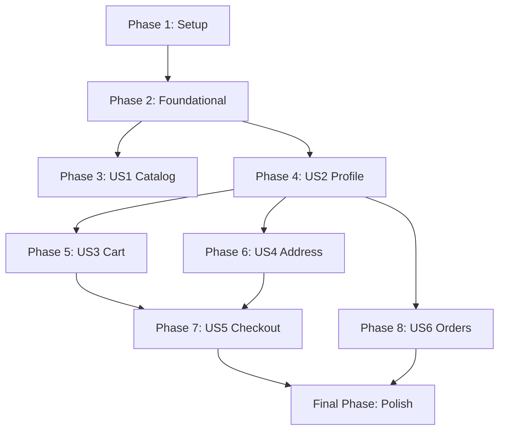

# Tasks: Talabat Customer API

**Input**: Design documents from `specs/003-customer-api/`
**Prerequisites**: plan.md, spec.md, research.md, data-model.md, contracts/

## Phase 1: Setup

- [X] T001 Rename `Talabat.API` project folder to `Talabat.Customer.API` in `src/Talabat/` and update project reference path in `src/Talabat/Talabat.slnx`
- [X] T002 Rename `Talabat.API.csproj` to `Talabat.Customer.API.csproj` in `src/Talabat/Talabat.Customer.API/` and update properties (AssemblyName, AssemblyTitle, root Namespace) to `Talabat.Customer.API`
- [X] T003 Update namespace references in Program.cs and controllers within `src/Talabat/Talabat.Customer.API/` from `Talabat.API` to `Talabat.Customer.API`
- [X] T004 Remove template code files `WeatherForecast.cs` and `Controllers/WeatherForecastController.cs` in `src/Talabat/Talabat.Customer.API/`

## Phase 2: Foundational

- [X] T005 Add nullable `string? IdentityUserId` property to `Customer` aggregate in `src/Talabat/Talabat.Domain/Aggregates/Customer/Customer.cs`
- [X] T006 Add `Customer.CreateForAccount` factory method in `src/Talabat/Talabat.Domain/Aggregates/Customer/Customer.cs`
- [X] T007 Add `GetByIdentityUserIdAsync` lookup to `ICustomerRepository` interface in `src/Talabat/Talabat.Domain/Interfaces/ICustomerRepository.cs`
- [X] T008 Implement `GetByIdentityUserIdAsync` in repository implementation `src/Talabat/Talabat.Infrastructure/Persistence/Repositories/CustomerRepository.cs`
- [X] T009 Configure `IdentityUserId` column mapping with unique filtered index in `src/Talabat/Talabat.Infrastructure/Persistence/Configurations/CustomerConfiguration.cs`
- [X] T010 Add EF Core migration for `IdentityUserId` column and apply to database schema in `src/Talabat/Talabat.Infrastructure/`
- [X] T011 [P] Implement concrete `SystemClock : IClock` in `src/Talabat/Talabat.Infrastructure/Time/SystemClock.cs`
- [X] T012 [P] Implement concrete `RestaurantLocalTimeProvider : IRestaurantLocalTimeProvider` in `src/Talabat/Talabat.Infrastructure/Time/RestaurantLocalTimeProvider.cs`
- [X] T013 Register `SystemClock` and `RestaurantLocalTimeProvider` in `src/Talabat/Talabat.Infrastructure/DependencyInjection.cs`
- [X] T014 Define `ICurrentUser` interface with `IdentityUserId`, `IsAuthenticated`, `HasProfile`, and `int? CustomerId` in `src/Talabat/Talabat.Application/Abstractions/ICurrentUser.cs`
- [X] T015 Create `CreateCustomerProfileCommand` and `CreateCustomerProfileHandler` in `src/Talabat/Talabat.Application/Customers/CreateProfile/`
- [X] T016 Implement static `DependencyInjection` with `AddApplication()` registering all use-case handlers in `src/Talabat/Talabat.Application/DependencyInjection.cs`
- [X] T017 Configure JwtBearer token validation (authority, signing keys) and Bearer authentication scheme in `src/Talabat/Talabat.Customer.API/Program.cs`
- [X] T018 [P] Implement `DomainExceptionHandler : IExceptionHandler` for RFC 9457 ProblemDetails mapping in `src/Talabat/Talabat.Customer.API/Middleware/DomainExceptionHandler.cs`
- [X] T019 Register exception handler middleware and diagnostics in `src/Talabat/Talabat.Customer.API/Program.cs`
- [X] T020 [P] Implement `UseCaseResultExtensions` mapping `ApplicationErrorCategory` categories to HTTP statuses in `src/Talabat/Talabat.Customer.API/Extensions/UseCaseResultExtensions.cs`
- [X] T021 Implement `CurrentUser : ICurrentUser` resolving from HTTP context user claims and querying database in `src/Talabat/Talabat.Customer.API/Auth/CurrentUser.cs`
- [X] T022 Register `CurrentUser` scoped service in `src/Talabat/Talabat.Customer.API/Program.cs`
- [X] T023 Configure development CORS policy (localhost only) in `src/Talabat/Talabat.Customer.API/Program.cs`
- [X] T024 Configure database and host health checks endpoint (`/health`) in `src/Talabat/Talabat.Customer.API/Program.cs`
- [X] T025 Create xUnit integration test project `tests/Talabat.Customer.API.Tests/Talabat.Customer.API.Tests.csproj` referencing the API project and add it to `src/Talabat/Talabat.slnx`
- [X] T026 Create `CustomWebApplicationFactory.cs` for integration test hosting in `tests/Talabat.Customer.API.Tests/Infrastructure/CustomWebApplicationFactory.cs`
- [X] T027 Create `TestAuthHandler.cs` for mock JWT authentication in `tests/Talabat.Customer.API.Tests/Infrastructure/TestAuthHandler.cs`
- [X] T028 Write auth enforcement tests verifying `401 Unauthorized` for owner-scoped paths and successful anonymous access in `tests/Talabat.Customer.API.Tests/AuthEnforcementTests.cs`

## Phase 3: User Story 1 — Catalog Browsing

**Goal**: Allow anyone (anonymous) to browse restaurants and menus.
**Independent Test**: Send GET to `/api/catalog/restaurants` and `/api/catalog/restaurants/{id}/menu` without credentials and check for 200 OK with correct JSON shapes.

- [X] T029 [P] [US1] Create request/response DTOs for catalog endpoints in `src/Talabat/Talabat.Customer.API/Contracts/Catalog/`
- [X] T030 [US1] Implement `CatalogController.cs` with routes `/api/catalog/restaurants` and `/api/catalog/restaurants/{restaurantId}/menu` in `src/Talabat/Talabat.Customer.API/Controllers/CatalogController.cs`
- [X] T031 [US1] Write integration tests for catalog browsing and menu retrieval in `tests/Talabat.Customer.API.Tests/CatalogEndpointTests.cs`

## Phase 4: User Story 2 — Customer Profile

**Goal**: Allow authenticated accounts to create their customer profile, retrieve it, or update it. Other owner-scoped endpoints must return `409 Conflict` (with `ProfileNotCreated` error code) if a profile doesn't exist yet.
**Independent Test**: Authenticate as a new account, check that calling GET `/api/me/profile` returns 404, call POST `/api/me/profile` to create, then verify GET `/api/me/profile` returns 200 OK with details. Verify other owner-scoped endpoints return `409 Conflict` (`ProfileNotCreated`) before profile creation.

- [X] T032 [P] [US2] Create request/response DTOs for profile endpoints in `src/Talabat/Talabat.Customer.API/Contracts/Customer/`
- [X] T033 [US2] Implement `CustomerController.cs` with routes `POST /api/me/profile` (create), `GET /api/me/profile` (get), and `PUT /api/me/profile` (update) in `src/Talabat/Talabat.Customer.API/Controllers/CustomerController.cs`
- [X] T034 [US2] Implement global profile enforcement filter or middleware that intercepts `/api/me/...` endpoints (except POST `/api/me/profile`) and returns `409 Conflict` (`ProfileNotCreated`) if `ICurrentUser.HasProfile` is false, registering it in `src/Talabat/Talabat.Customer.API/Program.cs`
- [X] T035 [US2] Write integration tests for profile creation, retrieval, updates, and profile-existence checks in `tests/Talabat.Customer.API.Tests/CustomerEndpointTests.cs`

## Phase 5: User Story 3 — Cart/Basket

**Goal**: Allow authenticated customers with a profile to manage their cart.
**Independent Test**: Authenticate, call cart endpoints, and verify cart contents update correctly.

- [X] T036 [P] [US3] Create request/response DTOs for cart endpoints in `src/Talabat/Talabat.Customer.API/Contracts/Cart/`
- [X] T037 [US3] Implement `CartController.cs` with GET, POST, PUT, DELETE routes for items and clearing cart in `src/Talabat/Talabat.Customer.API/Controllers/CartController.cs`
- [X] T038 [US3] Write integration tests for cart lifecycle (get, add, update, remove, clear) in `tests/Talabat.Customer.API.Tests/CartEndpointTests.cs`

## Phase 6: User Story 4 — Address Management

**Goal**: Allow authenticated customers with a profile to manage their delivery addresses.
**Independent Test**: Authenticate, manage addresses, and verify they list and set default correctly.

- [X] T039 [P] [US4] Create request/response DTOs for address endpoints in `src/Talabat/Talabat.Customer.API/Contracts/Address/`
- [X] T040 [US4] Implement `AddressController.cs` with routes for adding, removing, and setting default address in `src/Talabat/Talabat.Customer.API/Controllers/AddressController.cs`
- [X] T041 [US4] Write integration tests for address management (add, remove, set default) in `tests/Talabat.Customer.API.Tests/AddressEndpointTests.cs`

## Phase 7: User Story 5 — Checkout

**Goal**: Allow authenticated customers with a profile to check out their active cart using their address.
**Independent Test**: Authenticate, add items, checkout, verify 201 Created and order ID returned, or 422 if unavailable.

- [X] T042 [P] [US5] Create request/response DTOs for checkout endpoint in `src/Talabat/Talabat.Customer.API/Contracts/Checkout/`
- [X] T043 [US5] Implement `CheckoutController.cs` with `POST /api/me/checkout` route delegating to `CheckoutHandler` in `src/Talabat/Talabat.Customer.API/Controllers/CheckoutController.cs`
- [X] T044 [US5] Write integration tests for checkout success (201 Created) and unavailability failure (422 Unprocessable Entity) in `tests/Talabat.Customer.API.Tests/CheckoutEndpointTests.cs`

## Phase 8: User Story 6 — Order History & Details

**Goal**: Allow authenticated customers with a profile to view their past orders.
**Independent Test**: Authenticate, place orders, view order history and detail, verify only owned orders are visible.

- [X] T045 [P] [US6] Create request/response DTOs for order endpoints in `src/Talabat/Talabat.Customer.API/Contracts/Orders/`
- [X] T046 [US6] Implement `OrderController.cs` with `GET /api/me/orders` and `GET /api/me/orders/{id}` routes in `src/Talabat/Talabat.Customer.API/Controllers/OrderController.cs`
- [X] T047 [US6] Write integration tests for order history and details, verifying ownership enforcement, in `tests/Talabat.Customer.API.Tests/OrderEndpointTests.cs`

## Final Phase: Polish & Cross-Cutting Concerns

- [X] T048 Create structured authorization matrix document in `docs/authorization-matrix.md`
- [X] T049 Write exception mapping tests verifying specific exceptions map to correct HTTP status codes in `tests/Talabat.Customer.API.Tests/ErrorMappingTests.cs`
- [X] T050 Run package vulnerability audit and execute a full clean build and run of all tests in the solution to verify regression-free state

## Dependencies

## Parallel Execution Examples

- **Profile & Catalog (Phase 3 & 4)**:
  - T029 (Catalog DTOs) and T032 (Profile DTOs) can be developed in parallel.
  - T030 (Catalog Controller) and T033 (Profile Controller) can be implemented in parallel.
- **Cart & Address (Phase 5 & 6)**:
  - T037 (Cart Controller) and T040 (Address Controller) can be implemented in parallel.

## Implementation Strategy

1. **MVP Scope**: Complete Phase 1 (Setup), Phase 2 (Foundational), and Phase 4 (Profile creation/retrieval). This establishes the authentication boundary and user profile lifecycle.
2. **Incremental Delivery**: Following the profile lifecycle, implement anonymous browsing (Phase 3), cart management (Phase 5), address management (Phase 6), checkout (Phase 7), and order history (Phase 8) in sequence.
