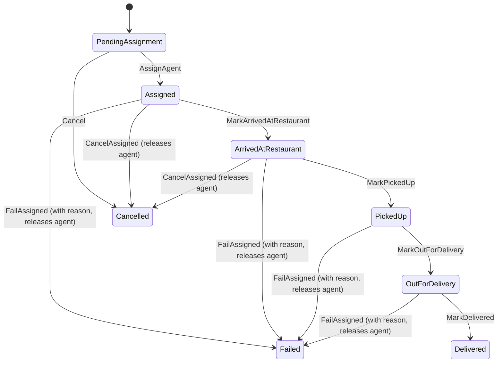

# Data Model: DeliveryAgent API

## 1. User Aggregate Root (DeliveryAgent Profile State)
The `User` entity serves as the single aggregate root representing the Delivery Agent's status and properties.

### Key Fields & Mapped Constraints
- **UserType**: Bitwise flags enum `UserType` (`None = 0`, `Customer = 1`, `DeliveryAgent = 2`, `Admin = 4`, `RestaurantOwner = 8`). Represents role capabilities.
- **DeliveryAgentStatus**: Enum (`Offline = 1`, `Available = 2`, `Busy = 3`, `Suspended = 4`). NULL-tolerant state only populated if `UserType` has the `DeliveryAgent` flag.
- **CurrentLocation**: Nested owned value object `GeoLocation` (`Latitude`, `Longitude`), configured as NULL-tolerant.
- **VehicleType**: Enum (`Bike = 1`, `Motorcycle = 2`, `Car = 3`). Required if applying/approved for `DeliveryAgent` role.
- **AgentApprovalStatus**: Enum (`PendingApproval = 1`, `Approved = 2`, `Rejected = 3`).
- **RowVersion**: Concurrency token mapped as database-managed row version (`byte[]`), ensuring optimistic concurrency checking on all updates.

### SQL Server Constraints (Configured in `UserConfiguration.cs`)
- `CK_Users_DeliveryAgent_Status`: Enforces that `DeliveryAgentStatus` is non-null if and only if `UserType` has the `DeliveryAgent` flag (value `& 2 == 2`).
- `CK_Users_DeliveryAgent_VehicleType`: Enforces that `VehicleType` is non-null if `AgentApprovalStatus` is pending, approved, or rejected.
- `CK_Users_DeliveryAgent_Coordinates`: Enforces `Latitude` between -90 and 90, and `Longitude` between -180 and 180 if not null.

---

## 2. Delivery Aggregate Root
Represents the operational task corresponding to an order delivery.

### Fields
- **Id**: `int` (SQL IDENTITY PK)
- **OrderId**: `int` (References Order)
- **CustomerId**: `int` (References User/Customer)
- **RestaurantId**: `int` (References Restaurant)
- **AssignedAgentId**: `int?` (Nullable foreign key referencing `AspNetUsers.Id`)
- **Status**: Enum `DeliveryStatus` (`PendingAssignment = 1`, `Assigned = 2`, `ArrivedAtRestaurant = 3`, `PickedUp = 4`, `OutForDelivery = 5`, `Delivered = 6`, `Cancelled = 7`, `Failed = 8`)
- **DeliveryAddress**: Owned value object `DeliveryAddressSnapshot` (`Street`, `City`, `BuildingNumber`, `Floor`)
- **Timestamps**:
  - `AssignedAt`
  - `ArrivedAtRestaurantAt`
  - `PickedUpAt`
  - `OutForDeliveryAt`
  - `DeliveredAt`
  - `CancelledAt`
  - `FailedAt`
- **FailureReason**: `string?` (Only set if `Status == Failed`)

### State Machine Transitions

---

## 3. Database Indexes
To support the DeliveryAgent queries:
- **Index on AssignedAgentId**: Non-clustered index on `Deliveries(AssignedAgentId)` to optimize queries for active deliveries and historical queries for a specific agent.
- **Index on Status**: Non-clustered index on `Deliveries(Status)` (filtered where `Status = 1` i.e. `PendingAssignment`) to speed up listing of unassigned deliveries.
- **Unique Constraint / Filtered Index**: A unique index on `Deliveries(AssignedAgentId)` filtered where `Status IN (2, 3, 4, 5)` (Assigned, ArrivedAtRestaurant, PickedUp, OutForDelivery) to enforce at the database level that an agent can only have **one active delivery** at any given time.
