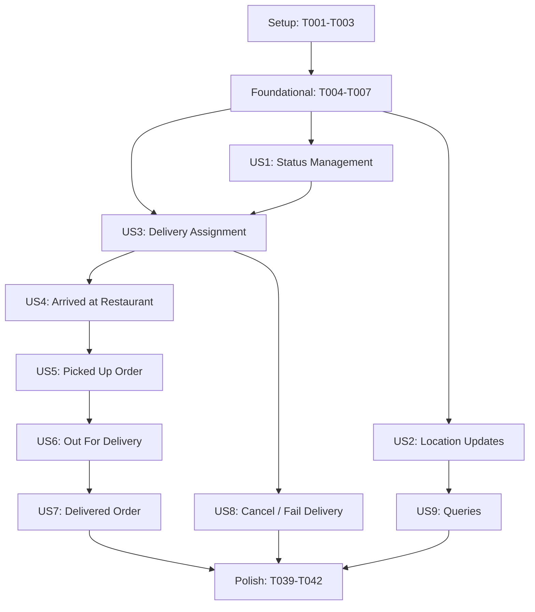

# Tasks: DeliveryAgent API

**Input**: Design documents from `specs/007-deliveryagent-api/`
**Prerequisites**: plan.md, spec.md, research.md, data-model.md, contracts/

## Phase 1: Setup

- [x] T001 Extend the `ICurrentUser` interface in `src/Talabat/Talabat.Application/Abstractions/ICurrentUser.cs` with `HasDeliveryAgentCapability` and `AgentId` properties
- [x] T002 Update the concrete `CurrentUser` class in `src/Talabat/Talabat.API/Auth/CurrentUser.cs` to resolve and return the new properties from `TalabatDbContext`
- [x] T003 Remove template files `WeatherForecast.cs` in `src/Talabat/Talabat.Delivery.API/` and `Controllers/WeatherForecastController.cs` in `src/Talabat/Talabat.Delivery.API/Controllers/`

## Phase 2: Foundational

- [x] T004 Define new delivery-specific error codes in `src/Talabat/Talabat.Application/Common/Errors/ApplicationErrorCodes.cs` (or equivalent error catalog)
- [x] T005 Create helper `DomainExceptionHandler` and `DomainExceptionMapper` (or update existing mapper) to include mappings for delivery-specific domain exceptions in `src/Talabat/Talabat.API/Middleware/DomainExceptionHandler.cs`
- [x] T006 Configure authentication and authorization pipeline (JwtBearer, token validation, scope checking) in `src/Talabat/Talabat.Delivery.API/Program.cs`
- [x] T007 Implement the concrete `CurrentUser` class for the delivery API in `src/Talabat/Talabat.Delivery.API/Auth/CurrentUser.cs` that mirrors the Customer API implementation

## Phase 3: User Story 1 (Agent Status Management)

**Goal**: Enable delivery agents to go online (Available) and offline (Offline) safely.
**Independent Test**: Unit tests verifying status changes and correct state transitions on the User aggregate.

- [x] T008 [P] [US1] Create the `GoOnlineHandler` and request/response models in `src/Talabat/Talabat.Application/DeliveryAgents/GoOnline/`
- [x] T009 [P] [US1] Create the `GoOfflineHandler` and request/response models in `src/Talabat/Talabat.Application/DeliveryAgents/GoOffline/`
- [x] T010 [US1] Create `StatusController` in `src/Talabat/Talabat.Delivery.API/Controllers/StatusController.cs` to route online/offline status update requests to application handlers
- [x] T011 [US1] Write unit tests for GoOnline/GoOffline transitions in `tests/Talabat.Application.Tests/Domain/Users/UserStatusTests.cs`

## Phase 4: User Story 2 (Agent Location Updates)

**Goal**: Persist the delivery agent's real-world GPS coordinates (latitude and longitude).
**Independent Test**: API endpoint test verifying a location update returns 200 OK and correctly updates the coordinate values on the User model.

- [x] T012 [P] [US2] Create the `UpdateLocationHandler` and request models in `src/Talabat/Talabat.Application/DeliveryAgents/UpdateLocation/`
- [x] T013 [US2] Create `LocationController` in `src/Talabat/Talabat.Delivery.API/Controllers/LocationController.cs` to route location update requests to the handler
- [x] T014 [US2] Write unit tests for location updates in `tests/Talabat.Application.Tests/Domain/Users/UserLocationTests.cs`

## Phase 5: User Story 3 (Delivery Assignment)

**Goal**: Assign a pending delivery to an available delivery agent atomically.
**Independent Test**: Integration test showing that invoking assignment transitions the delivery status to `Assigned` and agent status to `Busy`.

- [x] T015 [US3] Create `AssignDeliveryAgentHandler` and request models in `src/Talabat/Talabat.Application/DeliveryAgents/AssignDelivery/` utilizing `DeliveryAssignmentDomainService`
- [x] T016 [US3] Add assignment route in `src/Talabat/Talabat.Delivery.API/Controllers/DeliveriesController.cs` mapping to `AssignDeliveryAgentHandler`
- [x] T017 [US3] Write integration tests for delivery assignment in `tests/Talabat.Application.Tests/Domain/Deliveries/DeliveryAssignmentTests.cs`

## Phase 6: User Story 4 (Lifecycle: Arrived at Restaurant)

**Goal**: Enable delivery agents to mark arrival at the restaurant.
**Independent Test**: Test verifying delivery transitions from `Assigned` to `ArrivedAtRestaurant` status.

- [x] T018 [P] [US4] Create `ArrivedAtRestaurantHandler` in `src/Talabat/Talabat.Application/DeliveryAgents/ProgressArrive/`
- [x] T019 [US4] Add arrived-at-restaurant route in `src/Talabat/Talabat.Delivery.API/Controllers/DeliveriesController.cs` mapping to `ArrivedAtRestaurantHandler`
- [x] T020 [US4] Write unit/integration tests for arrived-at-restaurant progression in `tests/Talabat.Application.Tests/Domain/Deliveries/DeliveryLifecycleTests.cs`

## Phase 7: User Story 5 (Lifecycle: Picked Up Order)

**Goal**: Enable delivery agents to mark the order as picked up from the restaurant.
**Independent Test**: Test verifying delivery transitions from `ArrivedAtRestaurant` to `PickedUp` status.

- [x] T021 [P] [US5] Create `PickUpOrderHandler` in `src/Talabat/Talabat.Application/DeliveryAgents/ProgressPickup/`
- [x] T022 [US5] Add picked-up route in `src/Talabat/Talabat.Delivery.API/Controllers/DeliveriesController.cs` mapping to `PickUpOrderHandler`
- [x] T023 [US5] Write unit/integration tests for picked-up progression in `tests/Talabat.Application.Tests/Domain/Deliveries/DeliveryLifecycleTests.cs`

## Phase 8: User Story 6 (Lifecycle: Out For Delivery)

**Goal**: Enable delivery agents to mark the delivery as out for delivery to the customer.
**Independent Test**: Test verifying delivery transitions from `PickedUp` to `OutForDelivery` status.

- [x] T024 [P] [US6] Create `OutForDeliveryHandler` in `src/Talabat/Talabat.Application/DeliveryAgents/ProgressOutForDelivery/`
- [x] T025 [US6] Add out-for-delivery route in `src/Talabat/Talabat.Delivery.API/Controllers/DeliveriesController.cs` mapping to `OutForDeliveryHandler`
- [x] T026 [US6] Write unit/integration tests for out-for-delivery progression in `tests/Talabat.Application.Tests/Domain/Deliveries/DeliveryLifecycleTests.cs`

## Phase 9: User Story 7 (Lifecycle: Delivered Order)

**Goal**: Mark delivery as delivered and release the agent back to Available status atomically.
**Independent Test**: Test verifying delivery transitions to `Delivered`, agent status transitions back to `Available`, and timestamps are accurately set.

- [x] T027 [US7] Create `DeliverOrderHandler` in `src/Talabat/Talabat.Application/DeliveryAgents/ProgressDeliver/`
- [x] T028 [US7] Add delivered route in `src/Talabat/Talabat.Delivery.API/Controllers/DeliveriesController.cs` mapping to `DeliverOrderHandler`
- [x] T029 [US7] Write unit/integration tests for completed delivery workflow in `tests/Talabat.Application.Tests/Domain/Deliveries/DeliveryLifecycleTests.cs`

## Phase 10: User Story 8 (Lifecycle: Cancel/Fail Delivery)

**Goal**: Cancel or fail active deliveries and release agents back to Available status.
**Independent Test**: Test verifying cancellation before pickup succeeds, failing with reason transitions status to `Failed`, and agent returns online.

- [x] T030 [P] [US8] Create `CancelDeliveryHandler` in `src/Talabat/Talabat.Application/DeliveryAgents/ProgressCancel/`
- [x] T031 [P] [US8] Create `FailDeliveryHandler` in `src/Talabat/Talabat.Application/DeliveryAgents/ProgressFail/`
- [x] T032 [US8] Add cancel and fail routes in `src/Talabat/Talabat.Delivery.API/Controllers/DeliveriesController.cs`
- [x] T033 [US8] Write unit/integration tests for cancellation and failure scenarios in `tests/Talabat.Application.Tests/Domain/Deliveries/DeliveryFailureTests.cs`

## Phase 11: User Story 9 (Queries)

**Goal**: Expose queries to retrieve active delivery details, historical deliveries, and pending deliveries.
**Independent Test**: Verification that query endpoints return correct datasets based on database seed.

- [x] T034 [P] [US9] Create `GetActiveDeliveryHandler` in `src/Talabat/Talabat.Application/DeliveryAgents/GetActiveDelivery/`
- [x] T035 [P] [US9] Create `GetDeliveryHistoryHandler` in `src/Talabat/Talabat.Application/DeliveryAgents/GetDeliveryHistory/`
- [x] T036 [P] [US9] Create `GetPendingDeliveriesHandler` in `src/Talabat/Talabat.Application/DeliveryAgents/GetPendingDeliveries/`
- [x] T037 [US9] Expose query routes on `DeliveriesController` in `src/Talabat/Talabat.Delivery.API/Controllers/DeliveriesController.cs`
- [x] T038 [US9] Write query validation tests in `tests/Talabat.Application.Tests/Domain/Deliveries/DeliveryQueryTests.cs`

## Final Phase: Polish & Cross-Cutting Concerns

- [x] T039 Register all new application handlers in `src/Talabat/Talabat.Application/DependencyInjection.cs`
- [x] T040 Clean up any remaining CS0628 warnings (such as changing protected set to private set for `User.CreatedAt` in `src/Talabat/Talabat.Domain/Aggregates/Users/User.cs`)
- [x] T041 Verify the entire test suite passes successfully by running `dotnet test`
- [x] T042 Verify no vulnerable packages are referenced by executing package-vulnerability audits

## Dependencies

## Parallel Execution Examples

- **Status & Location Handler Parallelism**:
  - `T008 [P] [US1] Create GoOnlineHandler` and `T012 [P] [US2] Create UpdateLocationHandler` can be implemented simultaneously because status and location update logics are self-contained and reside in separate folders.
- **Lifecycle Handler Parallelism**:
  - `T018 [P] [US4] Create ArrivedAtRestaurantHandler`, `T021 [P] [US5] Create PickUpOrderHandler`, and `T024 [P] [US6] Create OutForDeliveryHandler` can be coded in parallel because they represent independent workflow steps that map cleanly to existing domain aggregates.

## Implementation Strategy

We will follow an incremental, story-based implementation strategy:
1. **MVP**: Complete **Phase 3 (User Story 1)** and **Phase 4 (User Story 2)** first to establish baseline agent functionality (online/offline availability and location tracking).
2. **Operations & Flow**: Implement **Phase 5 (User Story 3)** to allow deliveries to be assigned, and progress through intermediate lifecycle stages (**Phases 6–9**).
3. **Robustness & Queries**: Complete failure flows (**Phase 10**) and query API endpoints (**Phase 11**) to complete the operational requirement.
4. **Testing**: Run test suites at the end of each user story phase to verify that new capabilities do not break existing Customer/Identity pathways.
