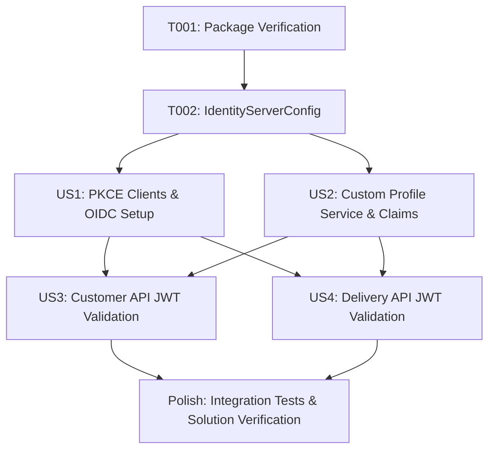

# Tasks: Token, Claims, and Scopes Refinement (Phase 9)

**Input**: Design documents from `specs/008-token-claims-scopes`
**Prerequisites**: plan.md, spec.md, research.md, data-model.md, contracts/openid-connect-contracts.md, quickstart.md

---

## Phase 1: Setup

- [x] T001 Verify package dependencies (`Duende.IdentityServer` 8.0.2, `Microsoft.AspNetCore.Authentication.JwtBearer` 10.0.9) and solution project references in `src/Talabat/Talabat.slnx`

---

## Phase 2: Foundational

- [x] T002 [P] Create `IdentityServerConfig.cs` in `src/Talabat/Talabat.Identity/IdentityServerConfig.cs` containing in-memory IdentityResources (`openid`, `profile`, `roles`), ApiScopes (`customer.api`, `delivery.api`), and ApiResources (`talabat.customer.api`, `talabat.delivery.api`)

---

## Phase 3: User Story 1 - Centralized OIDC Authentication & PKCE Client Registration (Priority: P1)

**Goal**: Expose standard OIDC discovery, authorization, and token endpoints with PKCE configuration for public SPA clients (`talabat-customer-spa` and `talabat-delivery-spa`) in `Talabat.Identity`.  
**Independent Test**: Launch `Talabat.Identity`, request `GET /.well-known/openid-configuration`, and perform Authorization Code + PKCE code exchange targeting `/connect/authorize` and `/connect/token`.

- [x] T003 [P] [US1] Add public SPA client definitions (`talabat-customer-spa`, `talabat-delivery-spa`) with Authorization Code + PKCE (`GrantTypes.Code`, `RequirePkce = true`, `RequireClientSecret = false`), allowed scopes, and exact redirect URIs in `src/Talabat/Talabat.Identity/IdentityServerConfig.cs`
- [x] T004 [US1] Wire Duende IdentityServer services (`AddIdentityServer`, `AddAspNetIdentity`, `AddInMemoryIdentityResources`, `AddInMemoryApiScopes`, `AddInMemoryApiResources`, `AddInMemoryClients`, `AddDeveloperSigningCredential`) in `src/Talabat/Talabat.Identity/Program.cs`
- [x] T005 [P] [US1] Configure dynamic CORS origin resolution middleware matching client `AllowedCorsOrigins` in `src/Talabat/Talabat.Identity/Program.cs`

---

## Phase 4: User Story 2 - Custom Token Emission with Profile Link Claims (Priority: P1)

**Goal**: Emit custom JWT access tokens containing subject (`sub` = `User.Id`), capability roles (`role`), and domain profile link claims (`customer_id` and `delivery_agent_id`).  
**Independent Test**: Authenticate a registered test user via `/connect/token` and decode the returned JWT to verify `sub`, `role`, `customer_id`, and `delivery_agent_id` claims exist.

- [x] T006 [P] [US2] Create custom `TalabatProfileService` implementing `IProfileService` in `src/Talabat/Talabat.Identity/TalabatProfileService.cs` to populate `sub`, `role`, `customer_id`, and `delivery_agent_id` claims from `UserManager<User>`
- [x] T007 [US2] Register `TalabatProfileService` with Duende IdentityServer using `.AddProfileService<TalabatProfileService>()` in `src/Talabat/Talabat.Identity/Program.cs`
- [x] T008 [P] [US2] Ensure eager profile link claim generation and role assignment in registration actions within `src/Talabat/Talabat.Identity/Controllers/AccountController.cs`

---

## Phase 5: User Story 3 - Customer Resource Server JWT Bearer Validation (Priority: P2)

**Goal**: Enable `Talabat.Customer.API` to validate incoming JWT bearer tokens issued by `Talabat.Identity` for audience `talabat.customer.api` and scope `customer.api`.  
**Independent Test**: Send an HTTP request with a valid Customer JWT token to `Talabat.Customer.API` and verify `200 OK` (or `404 ProfileNotCreated` profile contract); send request without token or with tampered signature and verify `401 Unauthorized`.

- [x] T009 [P] [US3] Add JWT Bearer authentication service configuration (`JwtBearerDefaults.AuthenticationScheme`) specifying Authority and Audience (`talabat.customer.api`) in `src/Talabat/Talabat.API/Program.cs`
- [x] T010 [US3] Add `UseAuthentication()` and `UseAuthorization()` middleware in correct pipeline order in `src/Talabat/Talabat.API/Program.cs`
- [x] T011 [P] [US3] Configure CORS policy allowing exact Customer SPA origin (`http://localhost:4200`) in `src/Talabat/Talabat.API/Program.cs`

---

## Phase 6: User Story 4 - Delivery Resource Server JWT Bearer Validation & Audience Isolation (Priority: P2)

**Goal**: Enable `Talabat.Delivery.API` to validate JWT bearer tokens for audience `talabat.delivery.api` and reject tokens issued for `talabat.customer.api` with HTTP `403 Forbidden`.  
**Independent Test**: Present a Customer API JWT token to `Talabat.Delivery.API` and verify immediate rejection with `403 Forbidden`; present a Delivery Agent JWT token and confirm acceptance.

- [x] T012 [P] [US4] Add JWT Bearer authentication service configuration specifying Authority and Audience (`talabat.delivery.api`) in `src/Talabat/Talabat.Delivery.API/Program.cs`
- [x] T013 [US4] Add `UseAuthentication()` and `UseAuthorization()` middleware in correct pipeline order in `src/Talabat/Talabat.Delivery.API/Program.cs`
- [x] T014 [P] [US4] Configure CORS policy allowing exact Delivery SPA origin (`http://localhost:4300`) in `src/Talabat/Talabat.Delivery.API/Program.cs`

---

## Final Phase: Polish & Cross-Cutting Concerns

- [x] T015 [P] Add integration tests in `tests/Talabat.Identity.Tests/IdentityServerTokenTests.cs` verifying OIDC discovery metadata, PKCE token issuance, and profile claim output
- [x] T016 [P] Add integration tests in `tests/Talabat.Customer.API.Tests/JwtBearerAuthenticationTests.cs` verifying valid token acceptance and audience rejection
- [x] T017 Run full solution build `dotnet build d:\link-dev\talabat\src\Talabat\Talabat.slnx` and `dotnet test` to confirm 100% clean build and test pass across all 7 projects

---

## Dependencies

---

## Parallel Execution Examples

### User Story 1 (PKCE & OIDC) & User Story 2 (Custom Claims)
- **Developer / Agent A**: Implement `src/Talabat/Talabat.Identity/IdentityServerConfig.cs` (T003)
- **Developer / Agent B**: Implement `src/Talabat/Talabat.Identity/TalabatProfileService.cs` (T006)

### User Story 3 (Customer API) & User Story 4 (Delivery API)
- **Developer / Agent A**: Configure `src/Talabat/Talabat.API/Program.cs` (T009, T011)
- **Developer / Agent B**: Configure `src/Talabat/Talabat.Delivery.API/Program.cs` (T012, T014)

---

## Implementation Strategy

1. **MVP First (Phases 1-4 / User Stories 1 & 2)**: Establish central IdentityServer authority, OIDC discovery, PKCE clients, and token claim emission (`sub`, `role`, `customer_id`, `delivery_agent_id`).
2. **Resource Server Protection (Phases 5-6 / User Stories 3 & 4)**: Wire JWT Bearer validation and CORS on business API hosts (`Talabat.Customer.API` and `Talabat.Delivery.API`), proving audience isolation.
3. **Quality Verification (Final Phase)**: Run automated integration tests proving sub-10ms JWT validation and 100% audience rejection for cross-API calls.
